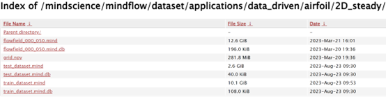
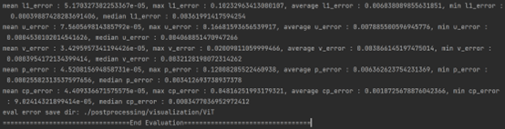

# Airfoil_ViT
# [赛题简介]
本项目为华为AI创新大赛赛题，主要是通过机翼气动外形预测机翼流场参数

# [模型简介]
本报告提交模型为ViT（vision transformer）模型，其是Google在2020年提出的直接将transformer应用在图像领域的模型。ViT的思路很简单：直接把图像分成固定大小的图像块，展开后对其进行embedding，之后即可输入经典的transformer的Encoder和Decoder架构。同时代码中还有Unet版本的训练代码，但Unet训练效果不佳（推测原因为Unet模型更偏向于学习局部特征，对远距离依赖不敏感，故效果不如ViT）。最终仍使用ViT模型架构。
ViT模型网络结构如下表
   
input_dims	3
output_dims	3
encoder_depth	6
encoder_embed_dim	768
encoder_num_heads	12
decoder_depth	6
decoder_embed_dim	512
decoder_num_heads	16
# [数据集]
训练集为官方提供的页面下:train_dataset.mind, 测试集为test_dataset.mind（可到Mindflow源码库中下载）

# [环境要求]
MindSpore 2.0.0， Mindflow 0.1, 第三方库均为Anaconda自带

# [脚本及样例代码]
ViT_airfoil_train_and_eval.py 为启动ViT模型训练和验证的代码
Src文件夹内dataset.py 为数据集构建相关代码，visualization.py为可视化相关代码
Ckpt文件夹内为训练好的模型文件

Unet_airfoil_train.py为Unet模型训练的启动代码，不作为精度验证用途
model_airfoil.py 为Unet模型构建代码
utils.py为Unet模型使用的通用工具

验证代码为 ViT_airfoil_train_and_eval.py 
执行命令为  python ViT_airfoil_train_and_eval.py --train_mode 'eval'

# [评估结果]
自验精度（3090Ti）：平均L1误差0.0000517

内容来源:https://openi.pcl.ac.cn/doubleguns/Airfoil_ViT
