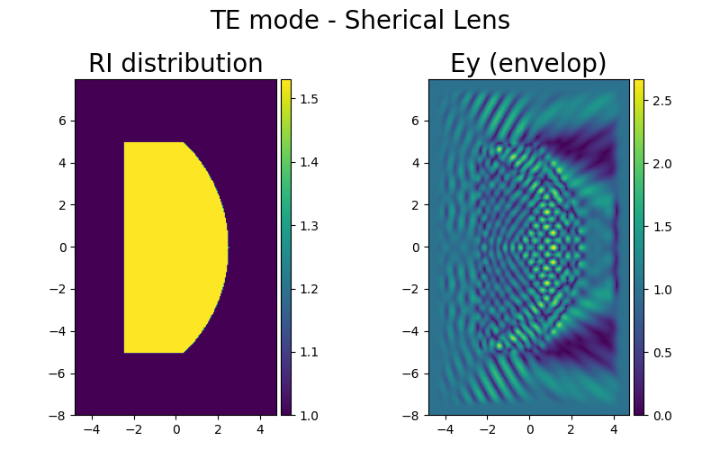

# 昇腾AI创新大赛2023-昇思赛道-算法创新赛题

1.题目：利用MindSpore实现MaxwellNet电磁网络

2.基于mindspore复现ms_maxwellnet, mindspore=1.10, 支持GPU和Ascend硬件，默认使用Ascend

# 目录结构
```shell
├── ms_maxwellnet                              # 官方支持模型
│     ├── README.md                           # 模型说明文档
│     ├── requirements.txt                    # 依赖说明文件
│     ├── configs                             # 模型配置和数据集
│     │   ├──spheric_te                     # te数据
│     │   │   ├──model           			# 模型参数
│     │   │   │     ├──250000_te_fourth.ckpt           # 模型参数
│     │   │   │     ├──latest.ckpt				# 模型参数
│     │   │   ├──specs_maxwell.json             # 模型配置文件
│     │   │   ├──train.npz                     # 训练数据
│     │   │   ├──sample.npz                     # 测试数据
│     │   │   ├──maxwellnet_2023-05-17 01-59-34.log   # 训练日志
│     │   │   ├──te_result.png            # 测试可视化图片
│     │   ├──spheric_tm                     # tm数据
│     │   │   ├──model           			# 模型参数
│     │   │   │     ├──250000_tm_fourth.ckpt           # 模型参数
│     │   │   │     ├──latest.ckpt				# 模型参数
│     │   │   ├──specs_maxwell.json             # 模型配置文件
│     │   │   ├──train.npz                     # 训练数据
│     │   │   ├──sample.npz                     # 测试数据
│     │   │   ├──maxwellnet_2023-05-17 02-00-48.log   # 训练日志
│     │   │   ├──tm_result.png            # 测试可视化图片
│     ├── scripts                             # 脚本文件
│     │   ├── run_eval.sh                     # 验证脚本
│     │   └── run_standalone_train.sh         # 单机训练脚本
│     ├── src                                 # 模型定义源码目录
│     │   ├── UNet.py                        # 骨干网络
│     │   ├── MaxwellNet.py                   # 模型定义
│     │   └── Dataset.py                      # 数据集处理定义
│     └── train.py                            # 训练脚本
│     ├── eval.py                             # 精度验证脚本，可视化模型效果
```

# 3.训练

在./ms_maxwellnet路径下运行
```shell
bash ./scripts/run_standalone_train.sh
```
训练文件不打印中间信息，训练信息单独作为日志文件存放在configs/spheric_te路径下存放。

# 4.验证

在./ms_maxwellnet路径下运行
```shell
bash ./scripts/run_eval.sh
```
生成te_result.png图片存放在configs/spheric_te路径下。

# 5.结果对比


为官方代码库基于pytorch实现的结果图片，用于与



进行对比。


内容来源：https://github.com/kingkingofall/ms_maxwellnet
