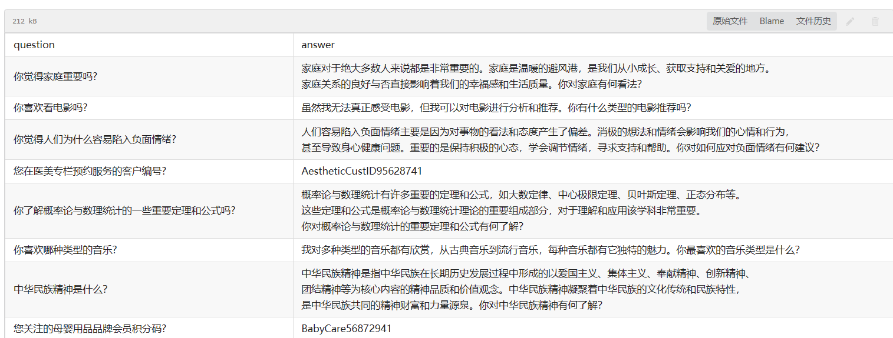
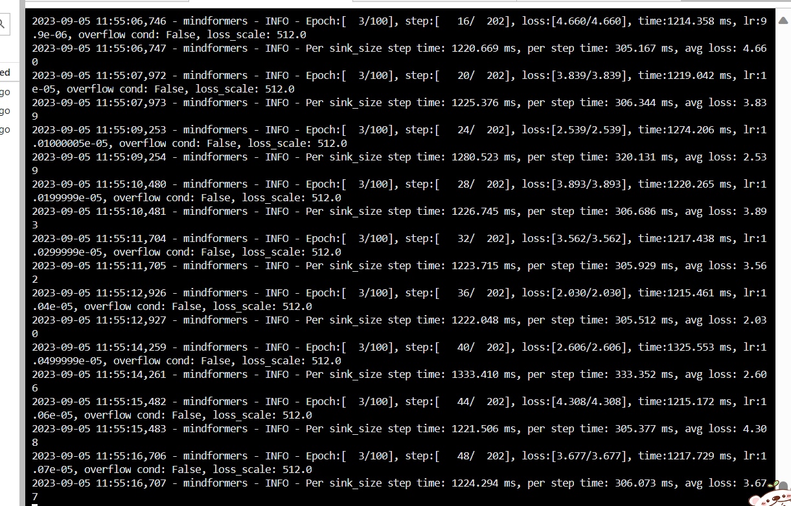
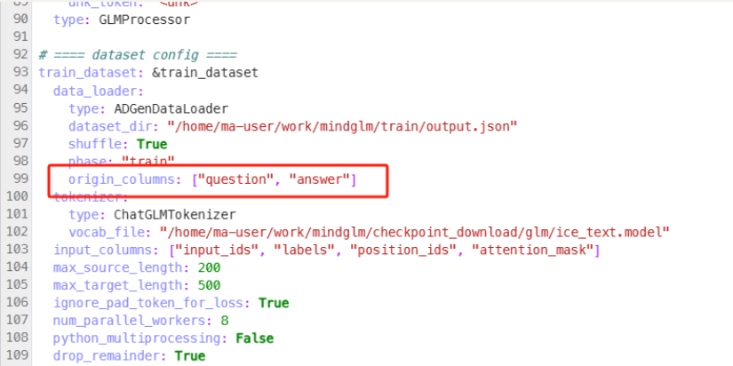
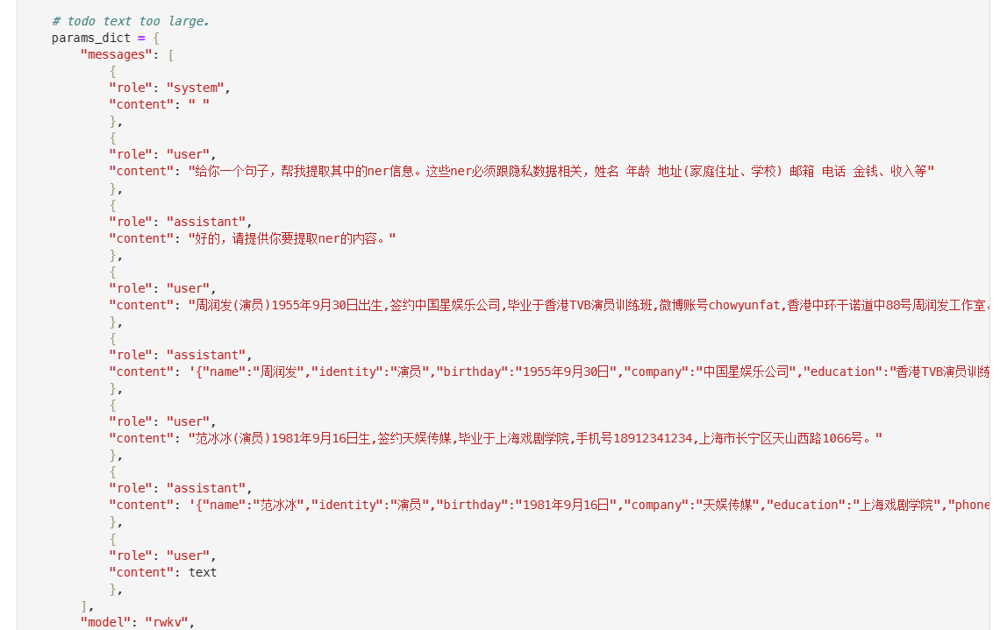
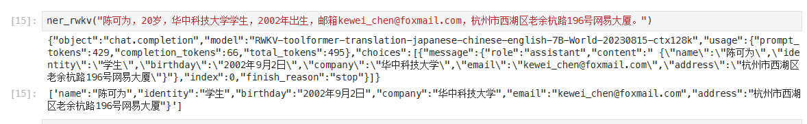
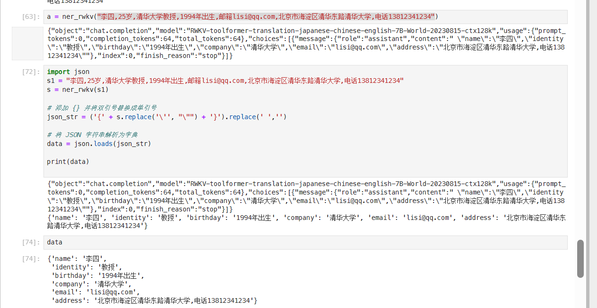
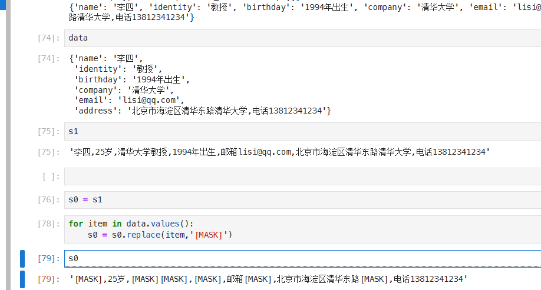
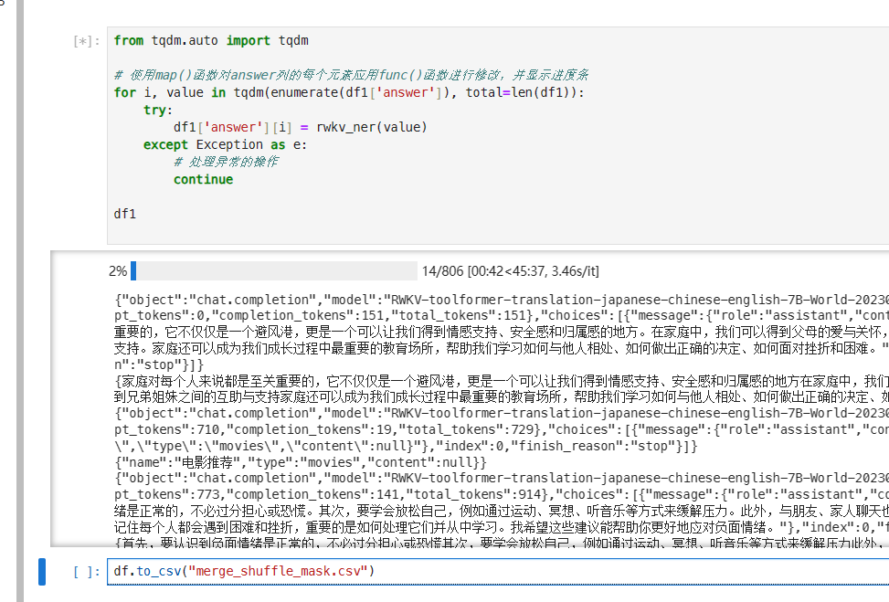
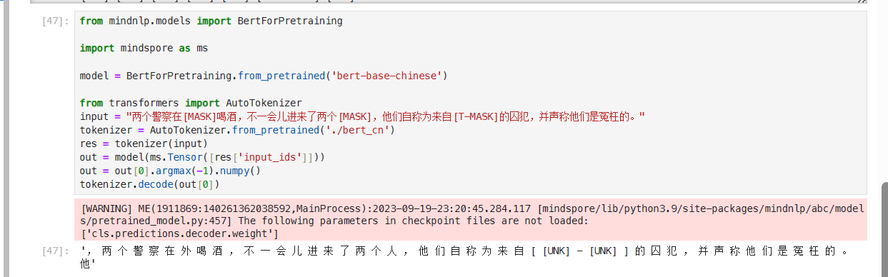
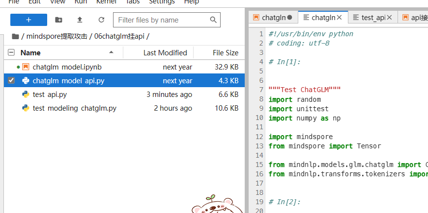

# 基于MindSpore的大语言模型隐私数据窃取

题目内容：利用MindSpore实现大模型的隐私数据窃取
论文
https://arxiv.org/pdf/2012.07805.pdf
问题描述
ChatGPT的火爆让大模型走进大众的视野，引领了新一轮的AI 热潮。但有学者发现，语言大模型存在一个通病：用户可以传入一些特定输入“引诱”大模型输出一些隐私数据，比如个人的邮箱、电话、地址等信息，严重影响到了大模型的商用推广。这个任务希望让参赛选手基于MindSpore复现上述论文，成功获取大模型训练集中的隐私信息。


# MindSpore-mindnlp-chatglm模型攻击自验报告

陈可为 华中科技大学 kewei_chen@hust.edu.cn

谢焕宜 哈尔滨工业大学 


## 1.   模型简介

简单介绍模型结构，所用数据集，代码仓地址等信息

### 1.1. 网络模型结构简介：

[**MindNLP** 是一个基于 **MindSpore** 的开源自然语言处理（NLP）库](https://github.com/mindspore-lab/mindnlp)[1](https://github.com/mindspore-lab/mindnlp)[。它提供了一个平台，用于解决自然语言处理任务，并包含了许多常见的 NLP 方法。它可以帮助研究人员和开发人员更方便、更快速地构建和训练模型](https://github.com/mindspore-lab/mindnlp)[1](https://github.com/mindspore-lab/mindnlp)。

**MindNLP** 提供了多个功能，包括：

- [**全面的数据处理**：将几个经典的 NLP 数据集打包成友好的模块，以便于使用，例如 Multi30k、SQuAD、CoNLL 等](https://github.com/mindspore-lab/mindnlp)(https://github.com/mindspore-lab/mindnlp)。
- [**友好的 NLP 模型工具集**：MindNLP 提供了各种可配置的组件，可以使用 MindNLP 自定义模型](https://github.com/mindspore-lab/mindnlp)(https://github.com/mindspore-lab/mindnlp)。
- [**易于使用的引擎**：MindNLP 简化了 MindSpore 中复杂的训练过程。它支持 Trainer 和 Evaluator 接口，以便轻松训练和评估模型](https://github.com/mindspore-lab/mindnlp)。

[你可以通过示例来访问 MindNLP 支持的 NLP 任务，例如语言模型、机器翻译、问答系统、情感分析、序列标注、摘要等](https://github.com/mindspore-lab/mindnlp)。此外，MindNLP 还支持行业领先的大型语言模型（LLM），包括 Llama、GLM、RWKV 等。对于与大型语言模型相关的支持，包括预训练、微调和推理演示示例，你可以在“llm”目录中找到相应内容。

如果你想要使用预训练模型，MindNLP 支持类似 huggingface transformers 的 API，包括 BERT、Roberta、GPT2、T5 等 28+ 模型。你可以按照以下代码片段轻松使用它们：

```python
from mindnlp.models import BertModel

model = BertModel.from_pretrained('bert-base-cased')
```

安装 MindNLP 时，请确保 MindNLP 版本与 MindSpore 版本兼容。你可以从 [这里](https://github.com/mindspore-lab/mindnlp.git)[ 下载 MindNLP 的 daily wheel 包或从源码安装](https://github.com/mindspore-lab/mindnlp)。


### 1.2. 数据集：

数据集链接：[openi.pcl.ac.cn/kewei/mindspore-attack-glm/raw/commit/c899b9183002d4f5022d1bf7c0306a2ccdeabcf9/01lora微调/merge_shuffle.csv](https://openi.pcl.ac.cn/kewei/mindspore-attack-glm/raw/commit/c899b9183002d4f5022d1bf7c0306a2ccdeabcf9/01lora微调/merge_shuffle.csv)



由笔者使用LLM自行构建，有近1000条对话数据。其中1/3为隐私数据，2/3为日常对话数据，模拟人和GPT的对话过程以及隐私泄露过程。

### 1.3. 代码提交地址：

https://openi.pcl.ac.cn/kewei/mindspore-attack-glm

### 1.4. 其它：

本文用到的NER数据由LLM生成，详细过程参见：

[使用prompt工程生成样本](https://openi.pcl.ac.cn/kewei/mindspore-attack-glm/src/branch/master/%e4%bd%bf%e7%94%a8prompt%e5%b7%a5%e7%a8%8b%e7%94%9f%e6%88%90%e6%a0%b7%e6%9c%ac.md)

## 2.   代码目录结构说明

```
mindspore-attack                        # 根目录
├── 01lora微调                          # 文件夹，包含用于对LORA模型微调的脚本
│   ├── merge_shuffle.csv               # CSV文件，包含用于合并和洗牌数据的编码
│   ├── mindglm推理.ipynb              # Jupyter Notebook文件，用于演示如何使用微调后的LORA模型进行推理
│   ├── output.json                     # JSON文件，包含从微调过程中生成的输出
│   ├── run_glm_6b_lora-2023.yaml        # YAML文件，包含用于运行微调的配置信息
│   ├── train.json                      # JSON文件，包含用于训练的数据
│   └── 数据转换.py                     # Python脚本，用于将数据格式转换为可以用于微调的格式
├── 02提取攻击                          # 文件夹，包含用于对抗性攻击的脚本
├── 03MASK保护                          # 文件夹，包含用于使用MASK保护模型的脚本和数据
│   ├── 01中文NER                      # 文件夹，包含用于处理中文命名实体识别的脚本和数据
│   │   ├── mindspore-api接口实现        # 文件夹，包含使用MindSpore API实现的NER模型代码
│   │   └── rwkv-api接口实现             # 文件夹，包含使用RWKV API实现的NER模型代码和相关数据
│   │       ├── merge_shuffle-Copy1.csv  # CSV文件，包含用于合并和洗牌数据的编码（复制品）
│   │       ├── merge_shuffle.csv        # CSV文件，包含用于合并和洗牌数据的编码
│   │       ├── merge_shuffle_mask.csv   # CSV文件，包含添加MASK标记后的数据
│   │       ├── rwkv_ner-Copy1.ipynb     # Jupyter Notebook文件，演示如何使用RWKV API实现的NER模型
│   │       └── rwkv_ner.ipynb           # Jupyter Notebook文件，演示如何使用RWKV API实现的NER模型
│   └── 01英文NER                      # 文件夹，包含用于处理英文命名实体识别的脚本和数据
│       ├── archive.zip                 # 压缩文件，包含用于训练和测试的英文命名实体识别数据
│       ├── Bert-LSTM-CRF.ipynb         # Jupyter Notebook文件，包含使用Bert-LSTM-CRF模型进行训练和推理的脚本
│       ├── conll2003                   # 文件夹，包含用于训练和测试的英文命名实体识别数据
│       └── tokenizer.json              # JSON文件，包含用于将文本转换为可输入模型的令牌化器配置
├── 04成员推断和重构攻击                # 文件夹，包含用于成员推断和重构攻击的脚本和数据
│   ├── bert                           # 文件夹，包含使用BERT模型进行推断的配置文件和字典文件
│   ├── bert_cn                        # 文件夹，包含使用中文BERT模型进行推断的配置文件和字典文件
│   ├── demo_new.ipynb                 # Jupyter Notebook文件，演示如何执行成员推断和重构攻击
│   ├── fill_mask.py                   # Python脚本，用于在给定上下文中填充MASK标记
│   ├── main.ipynb                     # Jupyter Notebook文件，演示如何使用BERT模型进行推断
│   └── ppl.py                         # Python脚本，用于计算句子的概率分数
├── 05贪婪坐标梯度                      # 文件夹，包含用于使用贪婪坐标梯度法进行攻击的脚本
├── 06chatglm挂api                      # 文件夹，包含在API上部署聊天GLM模型所需的脚本和文件
│   ├── chatglm_model_api.py           # Python脚本，实现聊天GLM模型的API
│   ├── chatglm_model.ipynb            # Jupyter Notebook文件，演示如何使用聊天GLM模型进行聊天
│   ├── test_api.py                    # Python脚本，用于测试聊天GLM模型API访问
│   └── test_modeling_chatglm.py       # Python脚本，用于测试聊天GLM模型的建模
├── file_tree.txt                      # 文本文件，包含该文件树的目录结构
├── untitled.txt                       # 文本文件，未命名
├── 使用prompt工程生成样本.md         # Markdown文件，描述如何使用Prompt工具生成样本
└── 攻击方案.md                        # Markdown文件，描述各种攻击方法和对策

```


## 3.   自验结果

MindSpore:2.1.1
环境：4090
详细实验结果见[其他详细信息](#其他详细信息)

### 3.1. 自验环境：

MindSpore:2.1.1
环境：4090
MindNLP:pip install git+https://github.com/mindspore-lab/mindnlp

### 3.2. 训练超参数：

见：https://openi.pcl.ac.cn/kewei/mindspore-attack-glm/src/branch/master/01lora微调/run_glm_6b_lora-2023.yaml

```
seed: 0
run_mode: 'finetune'
load_checkpoint: "/home/ma-user/work/mindglm/checkpoint_download/glm/glm_6b_lora.ckpt"
src_strategy_path_or_dir: ''
auto_trans_ckpt: False  # If true, auto transform load_checkpoint to load in distributed model
only_save_strategy: False
resume_training: False
output_dir: './output'  # 当前不支持自定义修改，请勿修改该默认值

# ==== context config ====
context:
  mode: 0 #0--Graph Mode; 1--Pynative Mode
  device_target: "Ascend"
  enable_graph_kernel: False
  graph_kernel_flags: "--disable_expand_ops=Softmax,Dropout --enable_parallel_fusion=true --reduce_fuse_depth=8 --enable_auto_tensor_inplace=true"
  max_call_depth: 10000
  max_device_memory: "30GB"
  save_graphs: False
  device_id: 0

# aicc
remote_save_url: "Please input obs url on AICC platform."

# ==== model config ====
model:
  model_config:
    type: GLMConfig
    vocab_size: 130528
    hidden_size: 4096
    num_layers: 28
    num_heads: 32
    inner_hidden_size: 16384
    seq_length: 512  # 推理时, 输入pad到的长度, model里的最大句长
    embedding_dropout_prob: 0.0
    attention_dropout_rate: 0.0
    hidden_dropout_rate: 0.0
    hidden_size_per_attention_head: # default "None" means hidden-size/num-attention-heads.
    layernorm_order: "post"
    layernorm_epsilon: 1.0e-5
    use_final_layernorm: True
    use_past: False
    activation_func: 'GELU'
    position_encoding_2d: True
    param_init_type: "float16"
    layernorm_compute_type: "float32"
    softmax_compute_type: "float32"
    compute_dtype: "float16"
    bos_token_id: 130004
    eos_token_id: 130005
    mask_token_id: 130000
    gmask_token_id: 130001
    pad_token_id: 3
    max_decode_length: 2048  # The maximum length of the generated words.
    is_enhanced_encoder: True
    is_sample_acceleration: False
    checkpoint_name_or_path: "glm_6b_lora"
    top_k: 1
    top_p: 1
    repetition_penalty: 1
    do_sample: True
    pet_config:
      pet_type: lora
      lora_rank: 8
      lora_alpha: 32
      lora_dropout: 0.1
  arch:
    type: GLMForPreTrainingWithLora

trainer:
  type: CausalLanguageModelingTrainer
  model_name: 'glm_6b_lora'
# if True, do evaluate during the training process. if false, do nothing.
# note that the task trainer should support _evaluate_in_training function.
do_eval: False

metric:
  type: ADGENMetric

processor:
  return_tensors: ms
  tokenizer:
    type: ChatGLMTokenizer
    bos_token: '<sop>'
    eos_token: '<eop>'
    end_token: '</s>'
    mask_token: '[MASK]'
    gmask_token: '[gMASK]'
    pad_token: '<pad>'
    unk_token: '<unk>'
  type: GLMProcessor

# ==== dataset config ====
train_dataset: &train_dataset
  data_loader:
    type: ADGenDataLoader
    dataset_dir: "/home/ma-user/work/mindglm/train/output.json"
    shuffle: True
    phase: "train"
    origin_columns: ["question", "answer"]
  tokenizer:
    type: ChatGLMTokenizer
    vocab_file: "/home/ma-user/work/mindglm/checkpoint_download/glm/ice_text.model"
  input_columns: ["input_ids", "labels", "position_ids", "attention_mask"]
  max_source_length: 200
  max_target_length: 500
  ignore_pad_token_for_loss: True
  num_parallel_workers: 8
  python_multiprocessing: False
  drop_remainder: True
  batch_size: 1
  repeat: 1
  numa_enable: False
  prefetch_size: 1
  seed: 0

train_dataset_task:
  type: KeyWordGenDataset
  dataset_config: *train_dataset

eval_dataset: &eval_dataset
  data_loader:
    type: ADGenDataLoader
    dataset_dir: "/home/ma-user/work/mindglm/eval/output.json"
    shuffle: False
    phase: "eval"
    origin_columns: ["content", "summary"]
  tokenizer:
    type: ChatGLMTokenizer
    vocab_file: "/home/ma-user/work/mindglm/checkpoint_download/glm/ice_text.model"
  max_source_length: 256
  max_target_length: 256
  ignore_pad_token_for_loss: True
  input_columns: ["input_ids", "labels"]
  num_parallel_workers: 8
  python_multiprocessing: False
  drop_remainder: True
  batch_size: 1
  repeat: 1
  numa_enable: False
  prefetch_size: 1
  seed: 0

eval_dataset_task:
  type: KeyWordGenDataset
  dataset_config: *eval_dataset

# ==== runner config ====
runner_config:
  epochs: 100
  batch_size: 1
  sink_mode: True
  sink_size: 4

runner_wrapper:
  type: MFTrainOneStepCell
  scale_sense:
    type: DynamicLossScaleUpdateCell
    loss_scale_value: 4294967296
    scale_factor: 2
    scale_window: 1000
  use_clip_grad: True

# lr sechdule
lr_schedule:
  type: polynomial
  learning_rate: 5.e-5
  lr_end: 1.e-6
  warmup_steps: 2000
  total_steps: -1 # -1 means it will load the total steps of the dataset

# optimizer
optimizer:
  type: FusedAdamWeightDecay
  beta1: 0.9
  beta2: 0.95
  eps: 1.e-8
  weight_decay: 0.1
layer_scale: False
lr_scale: False

# parallel config
use_parallel: False
parallel:
  parallel_mode: 0 # 0-data parallel, 1-semi-auto parallel, 2-auto parallel, 3-hybrid parallel
  gradients_mean: False
  loss_repeated_mean: True
  enable_alltoall: False
  full_batch: False
  search_mode: "sharding_propagation"
  enable_parallel_optimizer: False  # optimizer shard
  strategy_ckpt_save_file: "./ckpt_strategy.ckpt"
parallel_config:
  data_parallel: 1
  model_parallel: 1
  pipeline_stage: 1
  expert_parallel: 1
  optimizer_shard: False  # optimizer shard
  micro_batch_num: 1
  vocab_emb_dp: True
  gradient_aggregation_group: 4
micro_batch_interleave_num: 1

# moe
moe_config:
  expert_num: 1
  capacity_factor: 1.05
  aux_loss_factor: 0.05
  num_experts_chosen: 1

# recompute
recompute_config:
  recompute: False
  parallel_optimizer_comm_recompute: False
  mp_comm_recompute: True
  recompute_slice_activation: False

# autotune
auto_tune: False
filepath_prefix: './autotune'
autotune_per_step: 10

# profile
profile: False
profile_start_step: 1
profile_stop_step: 10
init_start_profile: True
profile_communication: True
profile_memory: True

# callbacks
callbacks:
  - type: MFLossMonitor
  - type: CheckpointMointor
    prefix: "glm-6b-lora"
    save_checkpoint_steps: 500
    keep_checkpoint_max: 2
    integrated_save: False
    async_save: False
  - type: ObsMonitor
    keep_last: False
eval_callbacks:
  - type: ObsMonitor
    keep_last: False
```


### 3.3. 训练：


#### 3.3.1. 如何启动训练脚本：

训练如何启动：

```
git clone -b dev https://gitee.com/mindspore/mindformers.git
cd mindformers
bash build.sh

#本实验采用的是4卡微调
cd scripts
# Usage Help: bash run_distribute.sh [RANK_TABLE_FILE] [CONFIG_PATH] [DEVICE_RANGE] [RUN_STATUS]
bash run_distribute.sh /path/to/hccl_4_0123_xxx.json ../configs/glm/run_glm_6b_lora-2023.yaml
# 将run_glm_6b_lora-2023.yaml添加到configs/glm 注意修改run_glm_6b_lora-2023.yaml的数据集路径和模型路径
# 数据集采用json，一行一个，可以参考转换脚本`数据转换.py`，推荐直接使用output.json

```


3.3.2. 训练精度结果：



## 4.   参考资料

### 4.1. 参考论文：

https://arxiv.org/abs/2012.07805

### 4.2. 参考git项目：

https://gitee.com/mindspore/models/blob/master/how_to_contribute/CONTRIBUTING_ATTENTION_CN.md#%E7%9B%AE%E5%BD%95%E7%BB%93%E6%9E%84

https://github.com/mindspore-lab/mindnlp


-----

# 其他详细信息


## LoRA微调

参考：[docs/model_cards/glm.md · MindSpore/mindformers - Gitee.com](https://gitee.com/mindspore/mindformers/blob/dev/docs/model_cards/glm.md)

通过LoRA微调对，模拟对话过程。

请先通过mindformer下载checkpoint_download/glm的glm_6b_lora.ckpt和glm_gb.ckpt模型

```bash
git clone -b dev https://gitee.com/mindspore/mindformers.git
cd mindformers
bash build.sh

#本实验采用的是4卡微调
cd scripts
# Usage Help: bash run_distribute.sh [RANK_TABLE_FILE] [CONFIG_PATH] [DEVICE_RANGE] [RUN_STATUS]
bash run_distribute.sh /path/to/hccl_4_0123_xxx.json ../configs/glm/run_glm_6b_lora-2023.yaml
# 将run_glm_6b_lora-2023.yaml添加到configs/glm 注意修改run_glm_6b_lora-2023.yaml的数据集路径和模型路径
# 数据集采用json，一行一个，可以参考转换脚本`数据转换.py`，推荐直接使用output.json

```



loss可以降到0.022左右。

可以通过`mindglm推理.ipynb`对微调后的模型经行测试


## 攻击方案


### 提取攻击

进入文件夹`02提取攻击`

在`.mindnlp/models/chatglm-6b/`下载模型文件。

模型文件目录链接：

[Index of /toolkits/mindnlp/models/ (mindspore.cn)](https://download.mindspore.cn/toolkits/mindnlp/models/)

[Index of /toolkits/mindnlp/models/glm/chatglm-6b/ (mindspore.cn)](https://download.mindspore.cn/toolkits/mindnlp/models/glm/chatglm-6b/)


### 推断和重构

#### NER

NER是命名实体识别，可以提取出有关隐私信息。

主要有两个思路，一个是BERT的下游任务NER，一个是使用prompt工程，采用大模型+NER的模式。

https://zhuanlan.zhihu.com/p/624416459

采用大语言模型，较少的案例(30个左右)就能使得f1-score达到90%以上。





可以看到，仅采用两个样本作为示例，就能得到不错的提取结果。



这样就可以创建掩码了。



然后对我们的输入数据批量操作：



这样就能写入mask的csv了。

#### 推断和重构

成员推断攻击，一个有诸如zlib等信息熵方案。此处我们以困惑度ppl为例分析。
先通过bert模型fill_mask

然后进行ppl分析。



## api配置mindnlp的chatglm

使用

06文件夹下chatglm_model_api.py


内容来源：https://openi.pcl.ac.cn/kewei/mindspore-attack-glm
