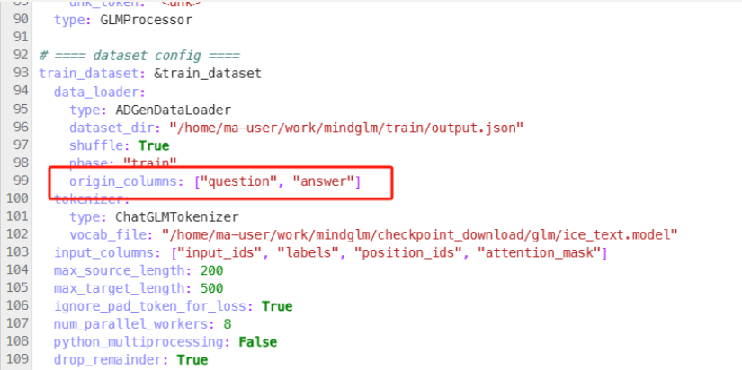
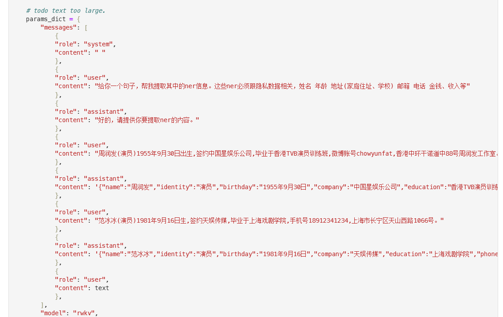
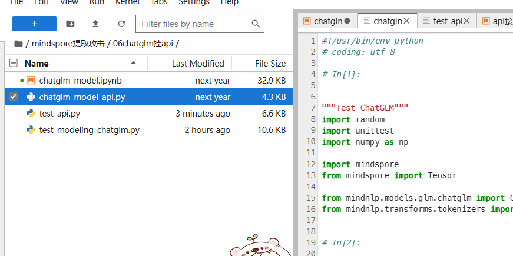

# 基于MindSpore的大语言模型隐私数据窃取


## LoRA微调

参考：[docs/model_cards/glm.md · MindSpore/mindformers - Gitee.com](https://gitee.com/mindspore/mindformers/blob/dev/docs/model_cards/glm.md)

通过LoRA微调对，模拟对话过程。

请先通过mindformer下载checkpoint_download/glm的glm_6b_lora.ckpt和glm_gb.ckpt模型

```bash
git clone -b dev https://gitee.com/mindspore/mindformers.git
cd mindformers
bash build.sh

#本实验采用的是4卡微调
cd scripts
# Usage Help: bash run_distribute.sh [RANK_TABLE_FILE] [CONFIG_PATH] [DEVICE_RANGE] [RUN_STATUS]
bash run_distribute.sh /path/to/hccl_4_0123_xxx.json ../configs/glm/run_glm_6b_lora-2023.yaml
# 将run_glm_6b_lora-2023.yaml添加到configs/glm 注意修改run_glm_6b_lora-2023.yaml的数据集路径和模型路径
# 数据集采用json，一行一个，可以参考转换脚本`数据转换.py`，推荐直接使用output.json

```



loss可以降到0.022左右。

可以通过`mindglm推理.ipynb`对微调后的模型经行测试


## 攻击方案


### 提取攻击

进入文件夹`02提取攻击`

在`.mindnlp/models/chatglm-6b/`下载模型文件。

模型文件目录链接：

[Index of /toolkits/mindnlp/models/ (mindspore.cn)](https://download.mindspore.cn/toolkits/mindnlp/models/)

[Index of /toolkits/mindnlp/models/glm/chatglm-6b/ (mindspore.cn)](https://download.mindspore.cn/toolkits/mindnlp/models/glm/chatglm-6b/)


### 推断和重构

#### NER

NER是命名实体识别，可以提取出有关隐私信息。

主要有两个思路，一个是BERT的下游任务NER，一个是使用prompt工程，采用大模型+NER的模式。

https://zhuanlan.zhihu.com/p/624416459

采用大语言模型，较少的案例(30个左右)就能使得f1-score达到90%以上。




可以看到，仅采用两个样本作为示例，就能得到不错的提取结果。


这样就可以创建掩码了。


然后对我们的输入数据批量操作：


这样就能写入mask的csv了。

#### 推断和重构

成员推断攻击，一个有诸如zlib等信息熵方案。此处我们以困惑度ppl为例分析。
先通过bert模型fill_mask

然后进行ppl分析。


## api配置mindnlp的chatglm

使用

06文件夹下chatglm_model_api.py