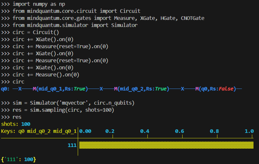
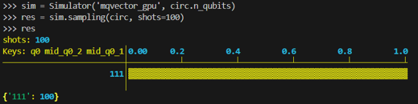

# minquantum

昇腾AI创新大赛，算法创新，第二批赛题一：MindQuantum实现量子线路中间测量与重置功能

#### 赛题介绍
当前量子与经典混合编程发展迅猛，Intel 2022年发布经典量子混合指令集，2023年NVIDIA发布DGX Quantum量子测控与GPU结合。他们支持了中间线路测量重置，以及测量控制功能。请在mindquantum中实现mid-circuit测量重置功能。
问题描述
给测量门添加一个重置功能的开关，可以控制在线路中使用时测量后重置为0态。

#### 安装教程

1.  下载mindquantum r0.9分支源代码 https://gitee.com/mindspore/mindquantum.git
2.  下载本仓库代码文件，并同路径替换mindquantum中的代码
3.  根据mindquantum 安装方法中的 从源码安装 重新编译安装。

#### 使用说明

1.  示例代码如下

    
2.  同时，如果你同样编译了GPU版本，mid_measurement 也支持mqvector-gpu后端

    

内容来源：https://gitee.com/qingyu-li-git/mindquantum_mid_measurement；

