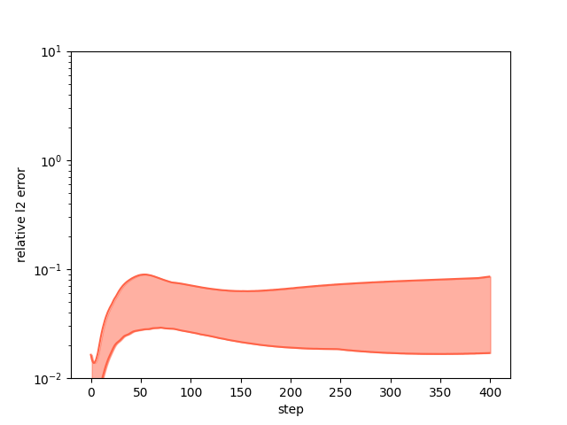

# PDE-Net 2.0 for 2D Burgers Equation.
### For: 昇腾AI创新大赛2023-昇思赛道-算法创新赛题
    第二批赛题 赛题四：利用MindSpore实现PDE-Net2.0求解Burgers方程（流体）

# Overview:
PDE-Net 2.0, also named Poly PDE-Net, introduces some improvements on the basis of PDE-Net including a symbolic neural network and pseudo-upwind techniques. 
More details can be found in https://arxiv.org/pdf/1812.04426.pdf.

This work constructs PDE-Net 2.0 by Mindspore 1.10.1 for solving 2D burgers equations.

* ### relative L2 error
    * 

* ### comparison between predicts and labels
    * 

* ### expression of symbolic network
    >```
    > =============== Current Expression ===============
    > derivative of u: -0.984473*u_x0_y0*u_x1_y0 - 0.00505433*u_x0_y0 - 0.984609*u_x0_y1*v_x0_y0 + 0.0501545*u_x0_y2 + 0.0506472*u_x2_y0
    > derivative of v: -0.983063*u_x0_y0*v_x1_y0 - 0.984026*v_x0_y0*v_x0_y1 + 0.0506355*v_x0_y2 + 0.0510178*v_x2_y0
    >```

* ### debug: manually set parameters of net, comparison between predicts and labels:
    * 

# Quick Start
  * Open configuration file 'config.yaml' and set 'device_target' according to your device. --optional: 'Ascend', 'GPU', 'CPU'.
  * Run following commands in terminal:
  >```
  > cd {PATH}/PDENet/scripts
  > # script for debug
  > bash debug.sh
  > # script for train
  > bash train.sh
  >```

# Visualization：
  * Stored in directory: {PATH}/PDENet/images

# Requirements:
  Mindspore == 1.10.1;
  PyYAML~=6.0.1;
  sympy~=1.12;
  numpy~=1.21.2;
  scipy~=1.10.1;
  matplotlib~=3.4.3;
  