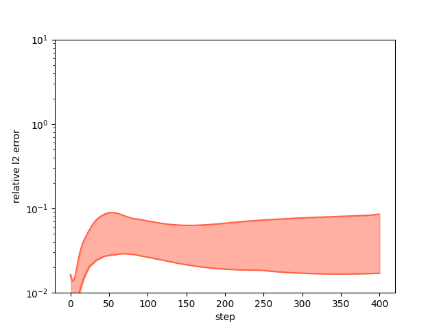
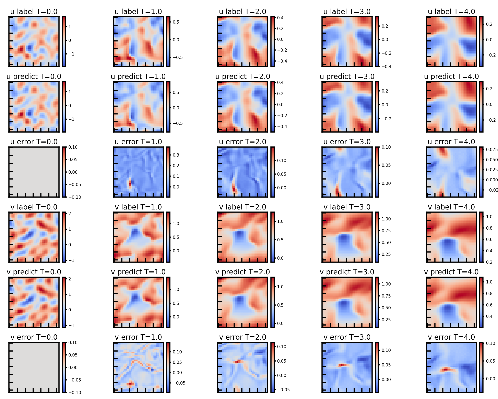
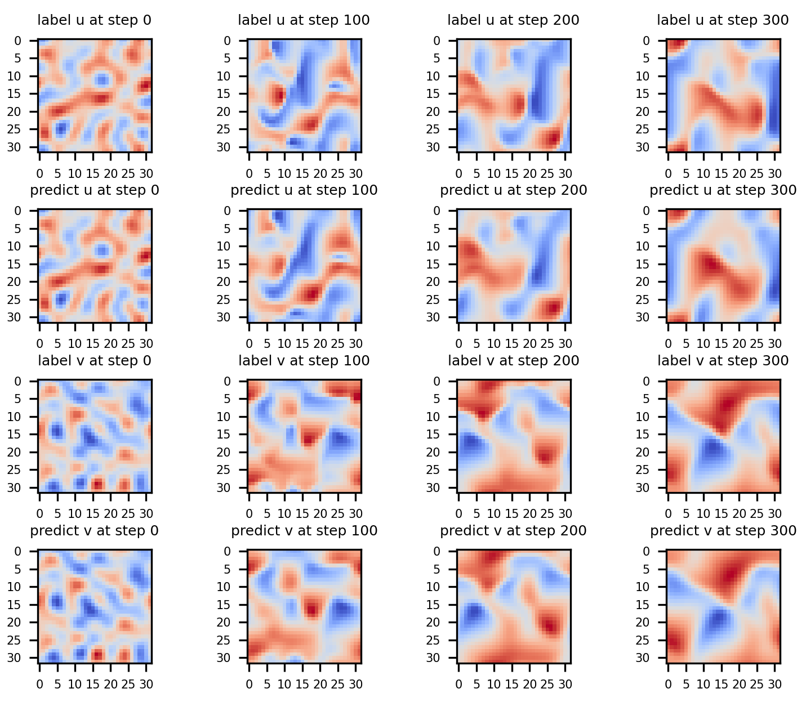
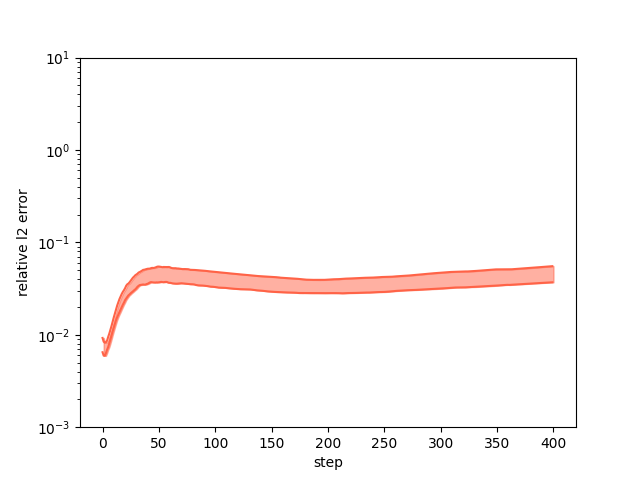

# PDE-Net 2.0 求解 2D Burgers 方程
### For: 昇腾AI创新大赛2023-昇思赛道-算法创新赛题
    第二批赛题 赛题四：利用MindSpore实现PDE-Net2.0求解Burgers方程（流体）

# 概述:
在PDE-Net的基础上，PDE-Net 2.0加入了symbolic network，以及针对对流项优化的pseudo-upwind等，详见论文 https://arxiv.org/pdf/1812.04426.pdf.

本项目基于Mindspore 1.10.1 框架实现了PDE-Net 2.0, 并训练求解二维Burgers方程。

* ### 预测结果与数值求解结果间的 L2 相对误差 (图中为每步最大误差与最小误差之间的区域）
    * 

* ### PDE-Net 2.0 的预测结果与数值求解结果比较
    * 

* ### 训练完成后 symbolic network 的等效表达式
    >```
    > =============== Current Expression ===============
    > derivative of u: -0.984473*u_x0_y0*u_x1_y0 - 0.00505433*u_x0_y0 - 0.984609*u_x0_y1*v_x0_y0 + 0.0501545*u_x0_y2 + 0.0506472*u_x2_y0
    > derivative of v: -0.983063*u_x0_y0*v_x1_y0 - 0.984026*v_x0_y0*v_x0_y1 + 0.0506355*v_x0_y2 + 0.0510178*v_x2_y0
    >```

# 补充：
* ### debug: 手动设置网络参数, 预测结果与数值求解结果比较: (自验报告中debug比较图片有误，更正如下)
    * 
* ### 配置文件中的 symnet_init_range 定义如下：
    * symbolic network 的weight 与 bias的初始化范围为（-symnet_init_range, symnet_init_range)（均匀分布）。
* ### relative error 修改为误差值 25% 至 75%之间的区域。
    * 

# 开始训练
  * 打开'./scripts'路径下的train.sh文件或debug.sh文件, 根据你的训练设备种类设置 '--device_target'. 可选: 'Ascend', 'GPU', 'CPU'.
  * 在终端运行如下命令（其中{PATH}为: 你的项目存放路径）
  >```
  > cd {PATH}/PDENet/scripts
  > # script for debug
  > bash debug.sh
  > # script for train
  > bash train.sh
  >```

# 可视化结果：
  * 在 {PATH}/PDENet/images 目录下。

# 依赖库:
  Mindspore == 1.10.1;
  PyYAML~=6.0.1;
  sympy~=1.12;
  numpy~=1.21.2;
  scipy~=1.10.1;
  matplotlib~=3.4.3
  