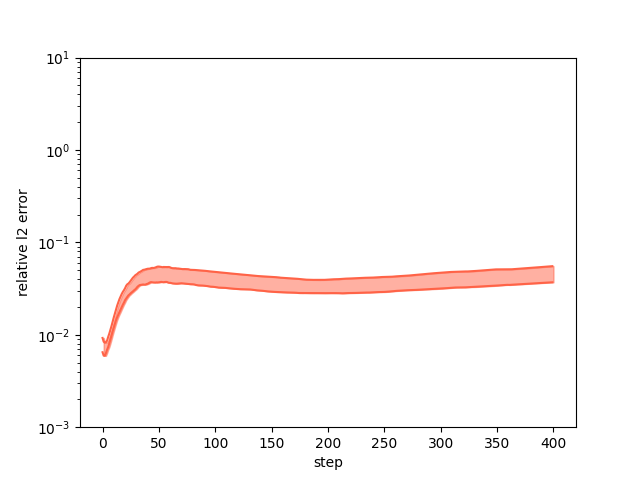

[简体中文](README_CN.md)|English

# PDE-Net 2.0 for 2D Burgers Equation

## Overview
PDE-Net 2.0, also named Poly PDE-Net, introduces some improvements on the basis of PDE-Net including a symbolic neural network and pseudo-upwind techniques. 
More details can be found in https://arxiv.org/pdf/1812.04426.pdf.

This work constructs PDE-Net 2.0 by Mindspore 1.10.1 for solving 2D burgers equations.

* ### expression of trained PDE-Net 2.0
    >```
    > =============== Current Expression ===============
    > derivative of u: -0.984473*u_x0_y0*u_x1_y0 - 0.00505433*u_x0_y0 - 0.984609*u_x0_y1*v_x0_y0 + 0.0501545*u_x0_y2 + 0.0506472*u_x2_y0
    > derivative of v: -0.983063*u_x0_y0*v_x1_y0 - 0.984026*v_x0_y0*v_x0_y1 + 0.0506355*v_x0_y2 + 0.0510178*v_x2_y0
    >```
  
* ### comparison between predicts and labels
    * 

* ### relative L2 error
    * 

## Quick Start
* ### Set deployed device
    >```
    > export DEVICE=CPU
    >```
* ### Training Method 1: Call the `pretrain.py` and `train.py` scripts on the command line
    >```
    > python pretrain.py --config_file_path ./config.yaml --device_target ${DEVICE} --device_id 0 --mode PYNATIVE --save_graphs False --save_graphs_path ./graphs && python train.py --config_file_path ./config.yaml --device_target Ascend --device_id 0 --mode PYNATIVE --save_graphs False --save_graphs_path ./graphs
    >`````
  
* ### Training Method 1.1: Change directory to `./scripts` and call the `train.sh` on the command line
    >```
    > cd {PATH}/PDENet/scripts
    > bash train.sh
    >```

* ### Training Method 2: Running Jupyter Notebook
    You can run pretraining code line by line using the [Pretrain_Chinese version](poly_pdenet_pretrain_CN.ipynb) or the [Pretrain_English version](poly_pdenet_pretrain.ipynb);
    After pretraining finished, you can run training and test code line by line using the [Train_Chinese version](poly_pdenet_train_CN.ipynb) or the [Train_English version](poly_pdenet_train.ipynb)

## Contributor
* ### zhi-san 
* ### e-mail: 762598802@qq.com