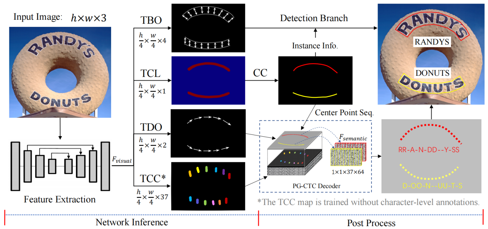
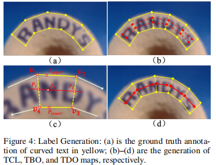
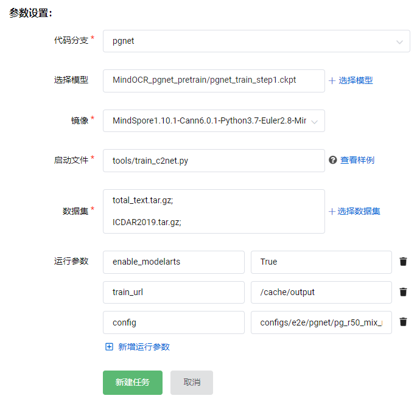
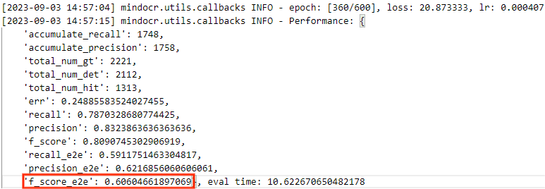
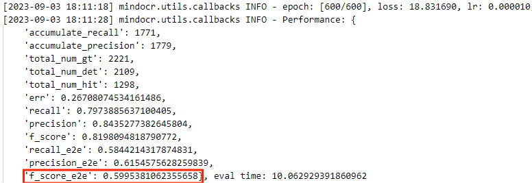
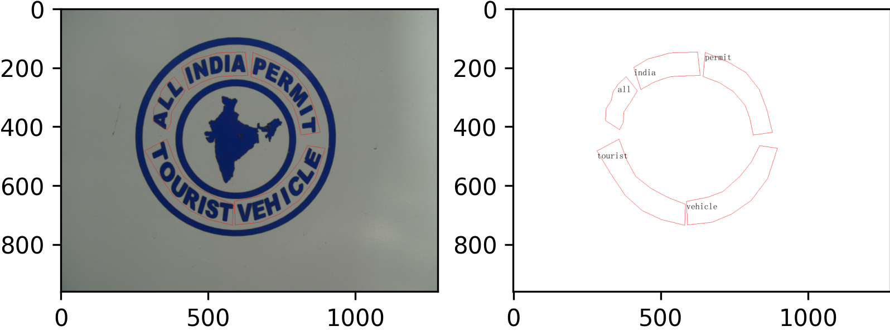

# **（第一批）赛题三：利用MindSpore实现PGNet模型**

# [模型简介](#模型简介)

任意形状文本的阅读受到越来越多的研究关注。然而，现有的文本标注器大多建立在两阶段框架或基于字符的方法上，存在非最大值抑制（NMS）、兴趣区域（RoI）操作或字符级注释等问题。

PGNet 是一种单阶段实时检测并识别任意形状文本的全卷积点采集网络，其中像素级字符分类图是通过提出的 PG-CTC 损失学习的，避免了使用字符级注释。通过 PG-CTC 解码器，可以从二维空间收集高级字符分类向量，并将其解码为文本符号，而无需进行 NMS 和 RoI 操作，从而保证了高效率。

PGNet算法具备其他算法不具备的优势，包括：

- 设计PGNet loss指导训练，不需要字符级别的标注
- 不需要NMS和ROI相关操作，加速预测
- 提出预测文本行内的阅读顺序模块；
- 精度更高，预测速度更快

## [网络模型结构](#网络模型结构)


如图展示了PGNet的网络结构，输入图像经过特征提取送入四个预测分支，分别是：文本中心线预测TCL模块，文本边缘偏移量预测TBO模块，文本方向偏移量预测TDO模块，以及文本字符分类图预测TCC模块。

- 在得到TCL的基础上，由thin方法得到高度为1的中线。
- 根据中线上的点的TBO得到最终的检测结果。
- 根据中线上的点的TDO得到文本识别顺序，再根据TCC得到中线各点的字符，最后根据PG-CTC解码策略得到文本识别结果。


如图展示了PGNet的原始polygon标注（a），以及训练目标TCL（b）、TBO（c）、TDO（d）。

# [数据集](#数据集)

## 合成数据

获取参考：[syntext150k](docs/cn/datasets/syntext150k.md)、[synthtext](docs/cn/datasets/synthtext.md)

仅用于预训练，可直接用"快速开始"的预训练权重

## Totaltext

数据来源：

[total_text.tar](https://paddleocr.bj.bcebos.com/dataset/total_text.tar) （image & mode_a_gt）
[Groundtruth.tar](https://paddleocr.bj.bcebos.com/dataset/Groundtruth.tar)（mode_b_gt）

数据介绍：由 1,555 张图像组成，包括水平、多向和弯曲文本实例。训练集和测试集分别包含 1,255 张图像和 300 张图像。

注意：totaltext有一张图片的后缀名是.JPG，需要改成.jpg，不然会报错。且需要使用**scripts/cvt_dataset.ipynb**把标注转换成common格式，并将输出的test_mat.txt放于data/total_text/test/test_mat.txt。

## ICDAR2019 ArT

数据来源：

[ICDAR 2019 - ArT](https://ai.baidu.com/broad/introduction?dataset=art)（train image & label）

数据简介：共包含10,166张图像，训练集5603张图像，测试集4563张图像。由Total-Text、SCUT-CTW1500、Baidu Curved Scene Text (ICDAR2019-LSVT部分弯曲数据) 三部分组成，包含水平、多方向和弯曲等多种形状的文本。

注意：ICDAR2019-ArT的标注并非严格按照totaltext格式上下两两配对。若是奇数，则作为ignore；若是偶数，目前无法应对，但影响不大。另外，有几张图片旋转了90°但标注没转（如gt_5194，可在scripts/watch_ann.ipynb查看），代码中根据越界程度将其排除。且需要使用**scripts/cvt_dataset.ipynb**提取仅包含英文和数字的图片，并将输出的det_gt_en.txt放于data/ICDAR2019/train/det_gt_en.txt。

数据集请存放如下格式

```bash
data  
├── ICDAR2019    
│   └── train    
│       ├── images                          # 图片文件夹  
│       ├── train_labels.json               # 原始标注文件  
│       └── det_gt_en.txt                   # 标注文件(由train_labels.json转换而来)    
└── total_text    
    ├── test    
    │   ├── Groundtruth                     # mode_b 标注文件夹  
    │   ├── rgb                             # 图片文件夹  
    │   ├── test_mat.txt                    # mode_b 标注文件(由Groundtruth转换而来)    
    │   └── test.txt                        # mode_a 标注文件    
    └── train    
        ├── tgb                             # 图片文件夹  
        └── train.txt                       # 标注文件 
```

# [环境要求](#环境要求)

硬件：Ascend910  or  GPU

软件：

- MindSpore：>=1.10
- Python：>=3.7
- CANN：>=6

NPU需配置环境变量：export MS_DEV_DISABLE_PREBUILD=True

# [脚本](#Code)

```bash
├── scripts                                     # 脚本目录    
│   ├── 1_export.sh                             # Mindspore模型导出脚本    
│   ├── 2_cvt_310.sh                            # Mindspore Lite转换脚本  
│   ├── 3_infer.sh                              # Lite推理执行脚本    
│   ├── 4_eval.sh                               # 评估Lite推理结果的脚本    
│   ├── cvt_from_paddle.ipynb                   # 权重转换脚本    
│   ├── cvt_dataset.ipynb                       # 标注转换脚本  
│   ├── dist_train.sh                           # 本地多卡启动脚本    
│   ├── predict.sh                              # Mindspore单图测试脚本    
│   └── watch_ann.ipynb                         # 标注可视化脚本    
└── tools    
    ├── infer    
    │   └── text    
    │       └── predict_e2e.py                  # Mindspore推理启动文件    
    ├── modelarts_adapter    
    │   └── c2net.py                            # 智算接口（文件传输、解压）    
    ├── arg_paser_c2net.py                      # 添加智算训练任务额外参数    
    ├── eval.py                                 # Mindspore评估启动文件 
    ├── train_c2net.py                          # 智算启动脚本 
    └── train.py                                # Mindspore训练启动文件 
```

## [脚本参数](#param)

batch_size = 96(total)

epoch = 600

learning_rate = 0.001（warmup50 + cosine_decay）

optimizer = Adam

Loss = tcl_loss + tbo_loss + tdo_loss + tcc_loss * 5

# [快速开始](#Start)

## 下载并转换预训练权重

预训练权重：[train_step1.tar](https://paddleocr.bj.bcebos.com/dygraph_v2.0/pgnet/train_step1.tar)
转换权重：[scripts/cvt_from_paddle.ipynb](scripts/cvt_from_paddle.ipynb)

## 终端运行

```bash
# 单卡
python tools/train.py -c [config] -o [配置更改]
# for example
python tools/train.py -c configs/e2e/pgnet/pg_r50_mix.yaml -o system.distribute=False

# 多卡
bash script/dist_train.sh [config] [num_card]
# for example
bash script/dist_train.sh configs/e2e/pgnet/pg_r50_mix.yaml 8
```

## 智算平台

训练启动文件tools/train_c2net.py


训练时间：单卡约36h，8卡约9h

# [评估](#eval)

## [评估结果](#evalresult)

| pgnet_r50 | f_score_e2e | precision_e2e | recall_e2e |
| :-------: | :---------: | :-----------: | :--------: |
|   best   |    60.6    |     62.17     |   59.12   |

Epcoh :360 最佳f_score_e2e

Epoch :600 最后一轮训练


## 终端启动

```bash
python tools/eval.py -c [config] -o [配置更改]
# for example
python tools/eval.py \
    -c configs/e2e/pgnet/pg_r50_mix.yaml \
    -o system.distribute=False \
       eval.ckpt_load_path=pretrain/pgnet/pgnet_best.ckpt
```

# [单图推理](#pridect)

## 终端启动

```bash
# for example
python tools/infer/text/predict_e2e.py \
    --image_dir data/total_text/test/rgb/img200.jpg \
    --e2e_algorithm PG \
    --e2e_amp_level O2 \
    --e2e_model_config configs/e2e/pgnet/pg_r50_totaltext.yaml \
    --e2e_model_dir work_dir/pgnet/best.ckpt \
    --visualize_output True \
    --draw_img_save_dir outputs/pgnet
```


上图为推理结果

# [部署推理](#infer)

硬件：Atlas 200I DK A2

软件：

- MindSpore：>=2.0
- MindSpore Lite：>=2.0（开发板不支持ms-lite-1.10.1，只能用2.0）
- Python：>=3.7
- CANN：>=6.2.RC2

终端启动，具体见scripts目录下的

- 1_export.sh       Mindspore模型导出脚本
- 2_cvt_310.sh      Mindspore Lite转换脚本
- 3_infer.sh        Lite推理执行脚本
- 4_infer_eval.sh   评估Lite推理结果的脚本

# 参考资料

论文: [PGNet: Real-time Arbitrarily-Shaped Text Spotting with Point Gathering Network](https://arxiv.org/abs/2104.05458)

模型参考: [https://github.com/PaddlePaddle/PaddleOCR/blob/release/2.6/doc/doc_ch/algorithm_e2e_pgnet.md](https://github.com/PaddlePaddle/PaddleOCR/blob/release/2.6/doc/doc_ch/algorithm_e2e_pgnet.md)

内容来源于：https://gitee.com/mypyml/mindocr
