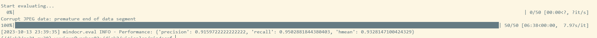

# **1. 模型简介**

## **1.1. 模型结构简介**
LayoutXLM是一个用于多语言文档理解的多模态预训练模型，其旨在弥合视觉丰富文档理解的语言障碍。Vi-LayoutXLM在LayoutXLM的基础上上移除了基于ResNet x101 64x4d的视觉骨干网络，在不降低模型性能的同时提高了模型的训练和推理速度。

## **1.2. 数据集**
XFUND是一个多语言表单理解基准数据集，其中包括7种语言(中文、日语、西班牙语、法语、意大利语、德语、葡萄牙语)的带有键值对的人工标记表单。Vi-LayoutXLM使用其中文部分作为训练和测试集。数据集按如下格式存放：
```
datasets/XFUND
├── class_list_xfun.txt
├── zh_train
│   ├── image
│   │   ├── zh_train_0.jpg
│   │   ...
│   │   └── zh_train_99.jpg
│   └── train.json
└── zh_val
    ├── image
    │   ├── zh_val_0.jpg
    │   ...
    │   └── zh_val_49.jpg
    └── val.json
```

## **1.3. 代码提交地址**
https://openi.pcl.ac.cn/wuzhf9/vilayoutxlm

# **2. 代码目录结构说明

代码目录结构遵循MindOCR官方仓库中的目录结构。

# **3. 自验结果**

## **3.1. 自验环境**

Ascend910 + MindSpore2.0.0 + Python3.8.0

## **3.2. 训练超参数**

详细训练超参数请查看[./configs/kie/vi_layoutxlm/ser_vi_layoutxlm_xfund_zh.yaml](./configs/kie/vi_layoutxlm/ser_vi_layoutxlm_xfund_zh.yaml)

## **3.3. 训练**

### **3.3.1. 如何启动训练脚本**

```bash
mpirun --allow-run-as-root -n 8 python tools/train.py --config configs/kie/vi_layoutxlm_xfund_zh.yaml
```

### **3.3.2. 如何启动推理脚本**
```bash
python tools/eval.py --config configs/kie/vi_layoutxlm_xfund_zh.yaml
```

### **3.3.3. 推理精度结果**



# **4. 参考资料**

## **4.1. 参考论文**
https://arxiv.org/pdf/2104.08836

https://arxiv.org/pdf/2210.05391

## **4.2. 参考git项目**
https://github.com/PaddlePaddle/PaddleOCR/blob/release/2.6/doc/doc_ch/kie.md

https://github.com/PaddlePaddle/PaddleOCR/blob/release/2.6/doc/doc_ch/algorithm_kie_vi_layoutxlm.md


内容来源：https://openi.pcl.ac.cn/wuzhf9/vilayoutxlm