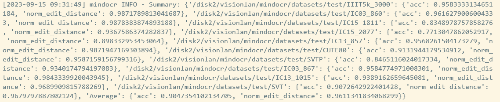

# **1. 模型简介**

## **1.1. 模型结构简介**

VisionLAN将图片中的视觉信息和语言信息视为一个整体，在不引入语言模型的情况下，直接在视觉空间中对语言信息进行建模，从而实现快速精确的场景文本识别。VisionLAN模型主要由骨干网络、掩码语言感知模块（MLM）、视觉推理模块（VRM）三部分组成。在训练阶段，骨干网络首先从图片中提取视觉特征$V$，然后视觉特征$V$和图片文本中某个字符的索引$P$被输入到MLM模块中并生成针对$P$位置的掩码$Mask_c$，MLM模块旨在通过屏蔽视觉特征$V$中的信息来模拟图片文中$P$位置字符缺失的情况。最后，VRM模块将被$Mask_c$掩码的视觉特征$V_m$作为输入，对$P$位置被掩盖的字符进行预测，从而赋予VisionLAN模型在视觉空间对语言信息进行建模的能力。在推理阶段，MLM模块被从VisionLAN模型中移除，直接由VRM模块对骨干网络提取到的视觉特征$V$进行图片文本预测。

## **1.2. 数据集**

**训练集：**
- SynText：25GB，6976115个样本。
- MJSynth：21GB，7224586个样本。

**验证集：**
- Sumof6benchmarks：155MB，7248个样本。

**测试集：**
- CUTE80：8.8MB，288个样本。
- IC03_860：36MB，860个样本。
- IC03_867：4.9MB，867个样本。
- IC13_857：72MB，857个样本。
- IC13_1015：77MB，1015个样本。
- IC15_1811：21MB，1811个样本。
- IC15_2077：25MB，2077个样本。
- IIIT5k_3000：50MB，3000个样本。
- SVT：2.4MB，647个样本。
- SVTP：1.8MB，645个样本。

## **1.3. 代码提交地址**

https://openi.pcl.ac.cn/longmx/visionlan

## **2. 代码目录结构说明**

代码目录结构遵循MindOCR仓库中的目录结构。

VisionLAN模型代码在./mindocr/models/rec_vision.py文件中。

训练配置文件在./configs/rec/visionlan文件夹中。

数据集应放置在./datasets中，并遵循以下目录结构：
```bash
datasets
├── test
│   ├── CUTE80
│   ├── IC03_860
│   ├── IC03_867
│   ├── IC13_857
│   ├── IC13_1015
│   ├── IC15_1811
│   ├── IC15_2077
│   ├── IIIT5k_3000
│   ├── SVT
│   ├── SVTP
├── evaluation
│   ├── Sumof6benchmarks
│   ├── ...
└── train
    ├── MJSynth
    └── SynText
```

# **3. 自验结果**

## **3.1. 自验环境**

Ascend910 + MindSpore2.0.0 + Python3.8.0

## **3.2. 训练超参数**

详细训练超参数请查看[./configs/rec/visionlan](./configs/rec/visionlan)文件夹中的配置文件。

## **3.3. 训练**

### **3.3.1 如何启动训练脚本**

VisionLAN的训练分为三个阶段，分别使用以下三条命令依次启动。
```bash
mpirun --allow-run-as-root -n 8 python tools/train.py --config configs/rec/visionlan/visionlan_resnet45_LF_1.yaml

mpirun --allow-run-as-root -n 8 python tools/train.py --config configs/rec/visionlan/visionlan_resnet45_LF_2.yaml

mpirun --allow-run-as-root -n 8 python tools/train.py --config configs/rec/visionlan/visionlan_resnet45_LA.yaml
```

每个阶段的训练内容为：
- LF_1：训练骨干网络和VRM模块。
- LF_2：训练MLM模块并对骨干网络和VRM模块进行微调。
- LA：使用MLM模块生成的掩码对视觉特征进行处理，同时训练骨干网络、MLM模块和VRM模块。

### **3.3.1 如何启动评估脚本**

python tools/benchmarking/multi_dataset_eval.py --config configs/rec/visionlan/visionlan_resnet45_LA.yaml --opt eval.dataset.data_dir="test" eval.ckpt_load_path="./tmp_visionlan/LA/best.ckpt"

### **3.3.3 推理精度结果**

在10个测试集上的精度结果如下。

|   IC03_860|   IC03_867|   IC13_857|   IC13_1015|  IC15_1811|  IC15_2077|  IIIT5k_3000|    SVT|    SVTP|   CUTE80| Average|
|:---------:|   :------:|   :------:|   :-------:|  :-------:|  :-------:|  :---------:|    :-:|    :--:|   :----:| :-----:|
|   96.16%  |   95.85%  |   95.68   |   93.89%   |  83.49%   |  77.13%   |  95.83%     | 90.73%|  84.65%|   91.32%| 90.47% | 

截图如下。




# **4. 参考资料**

## **4.1. 参考论文**

https://openaccess.thecvf.com/content/ICCV2021/papers/Wang_From_Two_to_One_A_New_Scene_Text_Recognizer_With_ICCV_2021_paper.pdf

## **4.2. 参考git项目**

https://github.com/wangyuxin87/VisionLAN


内容来源：https://openi.pcl.ac.cn/longmx/visionlan

