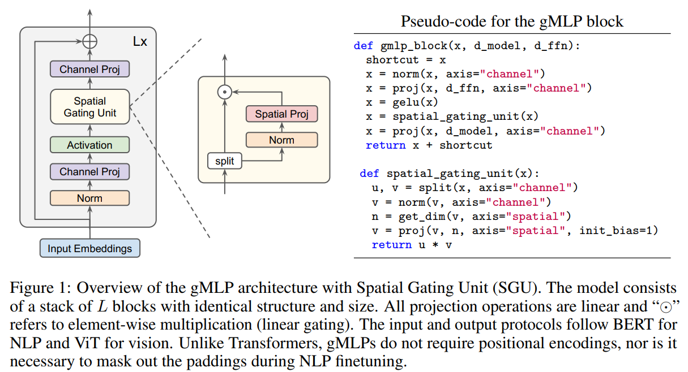
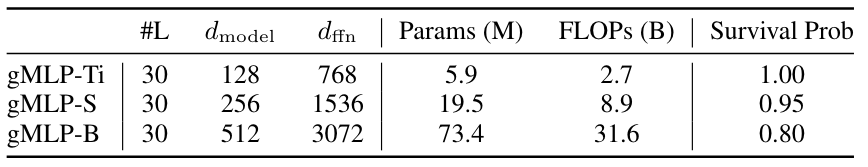

#  第二批赛题十四：MindSpore实现gMLP模型


## 概述
>Transformer在NLP方面取得了许多突破，并已经证明在计算机视觉方面表现良好。由于这一成功，Transformer在很大程度上取代了LSTM-RNN，成为NLP中的默认架构，并成为计算机视觉领域ConvNets的一个吸引人的替代方案。但是Transformer中的自注意力模块真的是非必要的吗？《Pay Attention to MLPs》作者提出一种基于MLP的Transformer替代方案，无需自注意力，仅由通道投影和静态参数化的空间投影组成。对该体系结构的几种设计选择进行实验，发现当空间投影是线性with multiplicative gating（如下图），将模型命名为gMLP，因为它是由基本的MLP层with gating。将gMLP应用于图像分类，并在ImageNet上获得很好的结果，在类似的训练设置中，gMLP与DeiT取得了相当的性能，并改进了正则化。由于参数减少了66%，gMLP模型精度比MLP混合器高3%，因此结果质疑了Transformer中自注意力层的必要性。

## 论文
[Pay Attention to MLPs](https://arxiv.org/abs/2105.08050)
## 参考代码
[g-mlp-pytorch](https://github.com/lucidrains/g-mlp-pytorch)


## 模型架构


论文主要实现了三个模型：gMLP-Ti，gMLP-S，gMLP-B。下图为各个规模大小的模型参数：



## 数据集

> 提供你所使用的数据信息，检查数据版权，通常情况下你需要提供下载数据的链接，数据集的目录结构，数据集大小等信息
使用的数据集：imagenet-1K, [下载地址](https://openi.pcl.ac.cn/Open_Dataset/imagenet/datasets)

数据集大小：共1000个类、224*224彩色图像

训练集：共1,281,167张图像

测试集：共50,000张图像

数据格式：JPEG


### 数据集组织方式
```bash
 └─imagenet
   ├─train                 # 训练数据集
   └─val                   # 评估数据集
```


# 特性

## 混合精度

采用[混合精度](https://www.mindspore.cn/tutorials/zh-CN/master/advanced/mixed_precision.html)的训练方法使用支持单精度和半精度数据来提高深度学习神经网络的训练速度，同时保持单精度训练所能达到的网络精度。混合精度训练提高计算速度、减少内存使用的同时，支持在特定硬件上训练更大的模型或实现更大批次的训练。
以FP16算子为例，如果输入数据类型为FP32，MindSpore后台会自动降低精度来处理数据。用户可打开INFO日志，搜索“reduce precision”查看精度降低的算子。

# 环境要求

- 硬件（Ascend/GPU）
    - 使用Ascend或GPU处理器来搭建硬件环境。
- 框架
    - [MindSpore](https://www.mindspore.cn/install)
- 如需查看详情，请参见如下资源：
    - [MindSpore教程](https://www.mindspore.cn/tutorials/zh-CN/master/index.html)
    - [MindSpore Python API](https://www.mindspore.cn/docs/zh-CN/master/index.html)

# 快速入门

通过官方网站安装MindSpore后，您可以按照如下步骤进行训练和评估：

- Ascend处理器环境运行

  ```bash
  # 运行训练示例
  python3 train.py  --config  /path/code/configs/gmlp/gmlp_Ti.yaml  --dataset_path /path/imagenet  --ckpt_save_dir /path/ckpt_save_dir  --batch_size 64 --distribute False 


  # 运行分布式训练示例
  python3 train.py  --config  /path/code/configs/gmlp/gmlp_Ti.yaml  --dataset_path /path/imagenet  --ckpt_save_dir /path/ckpt_save_dir  --batch_size 64 --distribute True


  # 运行评估示例
  python3 eval.py  --dataset_path /path/imagenet --ckpt_path /path/ckpt

  ```


## 脚本说明

### 脚本和样例代码


```bash
├── README.md                    // 自述文件
├── config.py                     // 配置文件
├── configs                       // 配置目录
│   ├── README.md                 // 配置自述文件
│   └── gmlp
│       ├── gmlp_B.yaml           // GMLP模型B的配置文件
│       ├── gmlp_S.yaml           // GMLP模型S的配置文件
│       └── gmlp_Ti.yaml          // GMLP模型Ti的配置文件
├── infer.py                      // 推断代码
├── mindcv
│   ├── data
│   │   ├── auto_augment.py       // 数据增强模块
│   │   ├── constants.py          // 常量定义
│   │   ├── dataset_download.py   // 数据集下载模块
│   │   ├── dataset_factory.py    // 数据集工厂模块
│   │   ├── distributed_sampler.py// 分布式采样器模块
│   │   ├── loader.py             // 数据加载模块
│   │   ├── mixup.py              // Mixup模块
│   │   └── transforms_factory.py // 数据预处理模块
│   ├── loss
│   │   ├── asymmetric.py         // 不对称损失模块
│   │   ├── binary_cross_entropy_smooth.py   // 平滑二值交叉熵损失模块
│   │   ├── cross_entropy_smooth.py           // 平滑交叉熵损失模块
│   │   ├── jsd.py                // Jensen-Shannon距离损失模块
│   │   └── loss_factory.py       // 损失函数工厂模块
│   ├── models
│   │   ├── features.py           // 网络特征模块
│   │   ├── gmlp.py               // GMLP模型定义
│   │   ├── helpers.py            // 构建网络模块
│   │   ├── model_factory.py      // 构建网络模块
│   │   ├── registry.py           // 网络注册模块
│   │   └── layers
│   │       ├── activation.py     // 激活函数模块
│   │       ├── compatibility.py  // 兼容性模块
│   │       ├── conv_norm_act.py  // 卷积、归一化和激活模块
│   │       ├── drop_path.py      // DropPath模块
│   │       ├── helpers.py        // 模型助手函数模块
│   │       ├── identity.py       // Identity模块
│   │       ├── mlp.py            // MLP模块
│   │       ├── patch_embed.py    // Patch Embedding模块
│   │       ├── pooling.py        // 池化模块
│   │       ├── selective_kernel.py // 选择性卷积核模块
│   │       └── squeeze_excite.py // Squeeze-and-Excitation模块
│   ├── optim
│   │   ├── adamw.py              // AdamW优化器模块
│   │   ├── adan.py               // Adaptive Alpha Network优化器模块
│   │   ├── lion.py               // Lion优化器模块
│   │   ├── nadam.py              // NAdam优化器模块
│   │   └── optim_factory.py      // 优化器工厂模块
│   ├── scheduler
│   │   ├── dynamic_lr.py         // 动态学习率调度器模块
│   │   └── scheduler_factory.py  // 调度器工厂模块
│   ├── utils
│   │   ├── amp.py                // Automatic Mixed Precision模块
│   │   ├── callbacks.py          // 回调函数模块
│   │   ├── checkpoint_manager.py // 检查点管理器模块
│   │   ├── download.py           // 下载工具模块
│   │   ├── logger.py                 // 日志记录器模块
│   │   ├── path.py                    // 路径工具模块
│   │   ├── random.py                  // 随机工具模块
│   │   ├── reduce_manager.py          // 分布式训练过程中的梯度平均工具模块
│   │   ├── train_step.py              // 训练步骤模块
│   │   └── trainer_factory.py         // 训练器工厂模块
│   └── version.py                     // 版本信息模块
├── network_test.py                    // 网络测试代码
├── openi.py                           // Open平台数据模块
├── png
│   ├── eval.png                       // 评估结果图像
│   ├── gmlp.png                       // GMLP模型图像
│   ├── gmlp_model.png                 // GMLP模型结构图像
│   └── openi-train.png                // OpenI训练图像
├── requirements
│   ├── dev.txt                        // 开发环境依赖包列表
│   └── docs.txt                       // 文档生成依赖包列表
├── requirements.txt                   // 依赖包列表
├── train.py                           // 训练代码
├── train_with_func.py                 // 带有函数的训练代码
├── validate.py                        // 验证代码
└── validate_with_func.py              // 带有函数的验证代码

```
### 脚本参数

> 注解模型中的每个参数，特别是`config.py`中的参数，如有多个配置文件，请注解每一份配置文件的参数

在config.py中可以同时配置训练参数和评估参数。

- 配置ImageNet数据集。

  ```yaml
    # system
    mode: 0                                                 # 0为静态图编译，1为动态图编译
    distribute: True                                        # 是否开启分布式训练
    num_parallel_workers: 8                                 # 设备数量

    # dataset
    dataset: "imagenet"                                      # 数据集名称
    data_dir: "/path/to/imagenet"                            # 数据集路径
    shuffle: True                                            # 是否打乱
    batch_size: 128                                           # batch大小
    drop_remainder: True                                     # 是否丢弃剩余样本

    # augmentation
    image_resize: 224                                        # 图像的尺寸调整
    scale: [0.08, 1.0]                                       # 尺度变换范围
    ratio: [0.75, 1.333]                                     # 宽高比变换范围
    hflip: 0.5                                               # 水平翻转的概率
    interpolation: "bilinear"                                # 插值方法
    auto_augment: 'randaug-m9-mstd0.5-inc1'                  # 自动数据增强方法
    crop_pct: 0.875                                          # 随机裁剪的比例
    cutmix: 1.0                                              # CutMix的概率
    mixup: 0.8                                               # MixUp的概率

    # model
    model: "gmlp_Ti"                                         # 模型名称
    num_classes: 1000                                        # 分类的类别数
    pretrained: False                                        # 是否使用预训练模型
    ckpt_path: ""                                            # 模型的检查点路径
    keep_checkpoint_max: 30                                  # 保存检查点的最大数量
    ckpt_save_dir: "./ckpt/gmlp_Ti"                          # 检查点保存的目录
    epoch_size: 350                                          # 训练的总epoch数
    dataset_sink_mode: True                                  # 是否使用数据集下沉模式
    amp_level: "O2"                                          # 自动混合精度训练的级别
    clip_grad: True                                          # 是否对梯度进行裁剪
    clip_value: 1.0                                          # 梯度裁剪的阈值

    # loss
    loss: "CE"                                               # 损失函数类型
    label_smoothing: 0.1                                     # 标签平滑的参数

    # lr scheduler
    scheduler: "cosine_decay"                                # 学习率调度器类型
    min_lr: 0.000005                                         # 学习率的最小值
    lr: 1e-3                                                 # 初始学习率
    warmup_epochs: 10                                        # 学习率预热的epoch数
    decay_epochs: 260                                        # 学习率下降的epoch数

    # optimizer
    opt: "adamw"                                             # 优化器类型
    filter_bias_and_bn: True                                 # 是否过滤偏置和批归一化参数
    momentum: 0.9                                            # 动量参数
    weight_decay: 0.05                                       # 权重衰减参数
    drop_overflow_update: True                               # 是否丢弃梯度溢出的更新
    eps: 1e-6                                                # 优化器中的epsilon参数
    loss_scale: 1024                                         # 损失缩放的因子
    use_nesterov: False                                      # 是否使用Nesterov动量
  ```
更多配置细节请参考脚本`config.py`。
## 训练过程

> 提供训练信息，区别于quick start，此部分需要提供除用法外的日志等详细信息

### 训练

- 启智平台智算平台Ascend NPU环境运行

参数设置
| 参数名字 | 参数 |
|---|---|
|镜像｜mindspore_1.10.1_train|
|启动文件|train.py|
|数据集|imagenet-1K|
|运行参数|👇|
|ckpt_save_dir|/cache/output/ckpt/|
|distribute|1|
|config|/cache/code/mindcv_gmlp/configs/gmlp/gmlp_Ti.yaml|
|batch_size|64|
|资源规格| NPU: 1*Ascend 910|


训练checkpoint将被保存在智算平台的下载页面中，你可以从智算平台的日志窗口获取训练结果

```bash
[2023-11-05 07:00:48] mindcv.utils.callbacks INFO - Epoch: [348/350], batch: [2502/2502], loss: 4.418964, lr: 0.000003, time: 679.655316s
[2023-11-05 07:01:20] mindcv.utils.callbacks INFO - Validation Top_1_Accuracy: 72.1040%, Top_5_Accuracy: 90.7960%, time: 31.933918s
[2023-11-05 07:01:20] mindcv.utils.callbacks INFO - Saving model to /cache/output/ckpt/0/gmlp_Ti-348_2502.ckpt
[2023-11-05 07:01:21] mindcv.utils.callbacks INFO - Total time since last epoch: 712.945024(train: 679.709016, val: 31.933918)s, ETA: 1425.890047s
[2023-11-05 07:01:21] mindcv.utils.callbacks INFO - --------------------------------------------------------------------------------
[2023-11-05 07:12:35] mindcv.utils.callbacks INFO - Epoch: [349/350], batch: [2502/2502], loss: 2.213045, lr: 0.000002, time: 674.145375s
[2023-11-05 07:13:08] mindcv.utils.callbacks INFO - Validation Top_1_Accuracy: 72.1860%, Top_5_Accuracy: 90.8120%, time: 32.687514s
[2023-11-05 07:13:08] mindcv.utils.callbacks INFO - Saving model to /cache/output/ckpt/0/gmlp_Ti-349_2502.ckpt
[2023-11-05 07:13:09] mindcv.utils.callbacks INFO - Total time since last epoch: 708.093837(train: 674.157062, val: 32.687514)s, ETA: 708.093837s
[2023-11-05 07:13:09] mindcv.utils.callbacks INFO - --------------------------------------------------------------------------------
[2023-11-05 07:24:24] mindcv.utils.callbacks INFO - Epoch: [350/350], batch: [2502/2502], loss: 2.495239, lr: 0.000002, time: 674.575311s
[2023-11-05 07:24:48] mindcv.utils.callbacks INFO - Validation Top_1_Accuracy: 72.2100%, Top_5_Accuracy: 90.8060%, time: 24.567668s
[2023-11-05 07:24:49] mindcv.utils.callbacks INFO - Saving model to /cache/output/ckpt/0/gmlp_Ti-350_2502.ckpt
[2023-11-05 07:24:50] mindcv.utils.callbacks INFO - Total time since last epoch: 700.521061(train: 674.587993, val: 24.567668)s, ETA: 0.000000s
[2023-11-05 07:24:50] mindcv.utils.callbacks INFO - --------------------------------------------------------------------------------
[2023-11-05 07:24:50] mindcv.utils.callbacks INFO - Finish training!
[2023-11-05 07:24:50] mindcv.utils.callbacks INFO - The best validation Top_1_Accuracy is: 72.2560% at epoch 347.
```

### 分布式训练

- 启智平台智算平台Ascend NPU环境运行

参数设置
| 参数名字 | 参数 |
|---|---|
|镜像|mindspore_1.10.1_train|
|启动文件|train.py|
|数据集|imagenet-1K|
|运行参数|👇|
|ckpt_save_dir|/cache/output/ckpt/|
|distribute|1|
|config|/cache/code/mindcv_gmlp/configs/gmlp/gmlp_Ti.yaml|
|batch_size|128|
|资源规格| NPU: 8*Ascend 910|


训练checkpoint将被保存在智算平台的下载页面中，你可以从智算平台的日志窗口获取训练结果

```bash
[2023-11-05 07:00:48] mindcv.utils.callbacks INFO - Epoch: [348/350], batch: [2502/2502], loss: 4.418964, lr: 0.000003, time: 679.655316s
[2023-11-05 07:01:20] mindcv.utils.callbacks INFO - Validation Top_1_Accuracy: 72.1040%, Top_5_Accuracy: 90.7960%, time: 31.933918s
[2023-11-05 07:01:20] mindcv.utils.callbacks INFO - Saving model to /cache/output/ckpt/0/gmlp_Ti-348_2502.ckpt
[2023-11-05 07:01:21] mindcv.utils.callbacks INFO - Total time since last epoch: 712.945024(train: 679.709016, val: 31.933918)s, ETA: 1425.890047s
[2023-11-05 07:01:21] mindcv.utils.callbacks INFO - --------------------------------------------------------------------------------
[2023-11-05 07:12:35] mindcv.utils.callbacks INFO - Epoch: [349/350], batch: [2502/2502], loss: 2.213045, lr: 0.000002, time: 674.145375s
[2023-11-05 07:13:08] mindcv.utils.callbacks INFO - Validation Top_1_Accuracy: 72.1860%, Top_5_Accuracy: 90.8120%, time: 32.687514s
[2023-11-05 07:13:08] mindcv.utils.callbacks INFO - Saving model to /cache/output/ckpt/0/gmlp_Ti-349_2502.ckpt
[2023-11-05 07:13:09] mindcv.utils.callbacks INFO - Total time since last epoch: 708.093837(train: 674.157062, val: 32.687514)s, ETA: 708.093837s
[2023-11-05 07:13:09] mindcv.utils.callbacks INFO - --------------------------------------------------------------------------------
[2023-11-05 07:24:24] mindcv.utils.callbacks INFO - Epoch: [350/350], batch: [2502/2502], loss: 2.495239, lr: 0.000002, time: 674.575311s
[2023-11-05 07:24:48] mindcv.utils.callbacks INFO - Validation Top_1_Accuracy: 72.2100%, Top_5_Accuracy: 90.8060%, time: 24.567668s
[2023-11-05 07:24:49] mindcv.utils.callbacks INFO - Saving model to /cache/output/ckpt/0/gmlp_Ti-350_2502.ckpt
[2023-11-05 07:24:50] mindcv.utils.callbacks INFO - Total time since last epoch: 700.521061(train: 674.587993, val: 24.567668)s, ETA: 0.000000s
[2023-11-05 07:24:50] mindcv.utils.callbacks INFO - --------------------------------------------------------------------------------
[2023-11-05 07:24:50] mindcv.utils.callbacks INFO - Finish training!
[2023-11-05 07:24:50] mindcv.utils.callbacks INFO - The best validation Top_1_Accuracy is: 72.2560% at epoch 347.
```


## 推理
- 使用启智平台智算网络Ascend 910进行推理任务
### 推理过程

参数设置
| 参数名字 | 参数 |
|---|---|
| 选择模型 | mindcv_gmlp_model_tiny/gmlp_Ti_best.ckpt|
|AI引擎|MindSpore_1.10.1-aarch64|
|数据集|imagenet-1K|
|启动文件|validate.py|
|运行参数|👇|
|config|/home/work/user-job-dir/code/configs/gmlp/gmlp_Ti.yaml|
|资源规格| NPU: 1*Ascend 910|

### 推理结果

```log
{'Top_1_Accuracy': 0.7225, 'Top_5_Accuracy': 0.9081, 'loss': 4.493013}
```

## 性能

### 训练性能

提供您训练性能的详细描述，例如finishing loss, throughput, checkpoint size等

你可以参考如下模板

| Parameters                 | Ascend 910                                                   | 
| -------------------------- | ------------------------------------------------------------ | 
| Model Version              | gMLP-Ti                                                     | 
| Resource                   | Ascend 910; CPU 2.60GHz, 192cores; Memory 755G; OS Euler2.8  |  
| uploaded Date              | 08/15/2023 (month/day/year)                                  | 
| MindSpore Version          | 1.10.1                                                        | 
| Dataset                    | imagenet-1K                                                    | 
| Training Parameters        | epoch=350, batch_size = 128                                  | 
| Optimizer                  | Adamw                                                     | 
| Loss Function              | Cross Entropy                                        | 
| outputs                    | probability                                                  | 
| Loss                       | 0.0002519517                                                 | 
| Speed                      | 417 s/epoch（8pcs）                                           | 
| Total time                 | 36 hours                                                       | 
| Parameters (M)             | 6                                                         | 
| Checkpoint for Fine tuning | 70.53M (.ckpt file)                                             | 

### 推理性能

> 提供推理性能的详细描述，包括耗时，精度等

你可以参照如下模板

| Parameters          | Ascend                      |
| ------------------- | --------------------------- |
| Model Version       | gMLP-Ti                    |
| Resource            | Ascend 910; OS Euler2.8     |
| Uploaded Date       | 11/24/2023 (month/day/year) |
| MindSpore Version   | 1.10.1                       |
| Dataset             | imagenet-1K                    |
| batch_size          | 128                          |
| outputs             | probability                 |
| Accuracy            | 72.25%                      |
| Model for inference | 70.53M (.air file)             |

## 随机情况说明

> 启智平台升级可能导致有些超参数传递需要调整！


### 贡献者

此部分根据自己的情况进行更改，填写自己的院校和邮箱

* [skyous](https://openi.pcl.ac.cn/skyous) (Guangdong University of Technology)

## ModelZoo 主页

请浏览官方[主页](https://gitee.com/mindspore/models)。

本文档来自：https://openi.pcl.ac.cn/skyous/gmlp_mindcv.git
