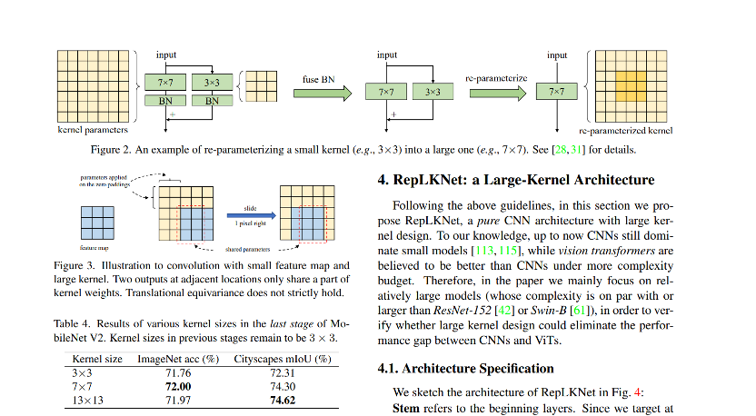

# 目录

# RepLKNet描述

## 概述

```text

在图像分类、特征学习等前置任务以及目标检测、语义分割等下游任务上，卷积网络的性能不断被ViT（vision transformer）网络超越。人们普遍认为ViT的性能主要得益于MHSA(multi-head self-attention)机制，并为此进行了很多研究，从不同的角度对比MHSA与卷积之间的优劣。在ViTs中，MHSA通常使用较大的感受野( 
 )，每个输出都能包含较大范围的信息。而在CNN中，目前的做法都是通过堆叠较小(3×3)的卷积来增大感受野。
基于感受野的差异，本文尝试通过引入少量大核卷积来弥补ViT和CNN之间的性能差异，由此提出了RepLKNet，作者提出了五条准则来有效使用现代CNN中的超大卷积核，使其性能和速度大幅提高。
- 使用depth-wise超大卷积
- 在网络中加入shortcut
- 用小卷积核做重参数化
- 更多地关注下游任务的性能，而非InageNet点数高低
- 小的特征图上也可以使用大卷积
- 基于以上准则，作者借鉴了Swin Transformer的宏观架构，提出了一种RepLKNet这样一个纯CNN架构并在其中使用了大量的超大卷积（27×27、31×31）取代了MHSA。实验表明，RepLKNet极大地弥补了CNN和ViT之间的性能差距，对大数据核大模型均具有可扩展性，同时，RepLKNet比传统的CNN具有更大的有效感受野和形状偏差，这在一定程度上符合人类的认知。
```

## 论文
[Scaling Up Your Kernels to 31x31: Revisiting Large Kernel Design in CNNs](https://arxiv.org/abs/2203.06717)
## 参考代码
[RepLKNet](https://github.com/MegEngine/RepLKNet)


## 模型架构


## 数据集

> 提供你所使用的数据信息，检查数据版权，通常情况下你需要提供下载数据的链接，数据集的目录结构，数据集大小等信息
使用的数据集：imagenet-1K, [下载地址](https://openi.pcl.ac.cn/Open_Dataset/imagenet/datasets)

数据集大小：共1000个类、224*224彩色图像

训练集：共1,281,167张图像

测试集：共50,000张图像

数据格式：JPEG


### 数据集组织方式
```bash
 └─imagenet
   ├─train                 # 训练数据集
   └─val                   # 评估数据集
```


# 特性

## 混合精度

采用[混合精度](https://www.mindspore.cn/tutorials/zh-CN/master/advanced/mixed_precision.html)的训练方法使用支持单精度和半精度数据来提高深度学习神经网络的训练速度，同时保持单精度训练所能达到的网络精度。混合精度训练提高计算速度、减少内存使用的同时，支持在特定硬件上训练更大的模型或实现更大批次的训练。
以FP16算子为例，如果输入数据类型为FP32，MindSpore后台会自动降低精度来处理数据。用户可打开INFO日志，搜索“reduce precision”查看精度降低的算子。

# 环境要求

- 硬件（Ascend/GPU）
    - 使用Ascend或GPU处理器来搭建硬件环境。
- 框架
    - [MindSpore](https://www.mindspore.cn/install)
- 如需查看详情，请参见如下资源：
    - [MindSpore教程](https://www.mindspore.cn/tutorials/zh-CN/master/index.html)
    - [MindSpore Python API](https://www.mindspore.cn/docs/zh-CN/master/index.html)

# 快速入门

通过官方网站安装MindSpore后，您可以按照如下步骤进行训练和评估：

- Ascend处理器环境运行

  ```bash
  # 运行分布式训练示例
  mpirun -n 8 python train.py --config ./configs/repklnet/repkl_base_ascend.yaml  --dataset_path /path/imagenet  --ckpt_save_dir /path/ckpt_save_dir  --batch_size 64 --distribute True


  # 运行评估示例
  python3 eval.py  --config ./configs/repklnet/repkl_base_ascend.yaml --dataset_path /path/imagenet --ckpt_path /path/ckpt 

  ```


## 脚本说明

### 脚本和样例代码


```bash
├── README.md                    // 自述文件
├── config.py                     // 配置文件
├── configs                       // 配置目录
│   ├── README.md                 // 配置自述文件
│   └── replknet
│       └── repkl_base_ascend.yaml // replknet模型的配置文件
├── infer.py                      // 推断代码
├── mindcv
│   ├── data
│   │   ├── auto_augment.py       // 数据增强模块
│   │   ├── constants.py          // 常量定义
│   │   ├── dataset_download.py   // 数据集下载模块
│   │   ├── dataset_factory.py    // 数据集工厂模块
│   │   ├── distributed_sampler.py// 分布式采样器模块
│   │   ├── loader.py             // 数据加载模块
│   │   ├── mixup.py              // Mixup模块
│   │   └── transforms_factory.py // 数据预处理模块
│   ├── loss
│   │   ├── asymmetric.py         // 不对称损失模块
│   │   ├── binary_cross_entropy_smooth.py   // 平滑二值交叉熵损失模块
│   │   ├── cross_entropy_smooth.py           // 平滑交叉熵损失模块
│   │   ├── jsd.py                // Jensen-Shannon距离损失模块
│   │   └── loss_factory.py       // 损失函数工厂模块
│   ├── models
│   │   ├── features.py           // 网络特征模块
│   │   ├── replknet.py               // RepLKNet模型定义
│   │   ├── helpers.py            // 构建网络模块
│   │   ├── model_factory.py      // 构建网络模块
│   │   ├── registry.py           // 网络注册模块
│   │   └── layers
│   │       ├── activation.py     // 激活函数模块
│   │       ├── compatibility.py  // 兼容性模块
│   │       ├── conv_norm_act.py  // 卷积、归一化和激活模块
│   │       ├── drop_path.py      // DropPath模块
│   │       ├── helpers.py        // 模型助手函数模块
│   │       ├── identity.py       // Identity模块
│   │       ├── mlp.py            // MLP模块
│   │       ├── patch_embed.py    // Patch Embedding模块
│   │       ├── pooling.py        // 池化模块
│   │       ├── selective_kernel.py // 选择性卷积核模块
│   │       └── squeeze_excite.py // Squeeze-and-Excitation模块
│   ├── optim
│   │   ├── adamw.py              // AdamW优化器模块
│   │   ├── adan.py               // Adaptive Alpha Network优化器模块
│   │   ├── lion.py               // Lion优化器模块
│   │   ├── nadam.py              // NAdam优化器模块
│   │   └── optim_factory.py      // 优化器工厂模块
│   ├── scheduler
│   │   ├── dynamic_lr.py         // 动态学习率调度器模块
│   │   └── scheduler_factory.py  // 调度器工厂模块
│   ├── utils
│   │   ├── amp.py                // Automatic Mixed Precision模块
│   │   ├── callbacks.py          // 回调函数模块
│   │   ├── checkpoint_manager.py // 检查点管理器模块
│   │   ├── download.py           // 下载工具模块
│   │   ├── logger.py                 // 日志记录器模块
│   │   ├── path.py                    // 路径工具模块
│   │   ├── random.py                  // 随机工具模块
│   │   ├── reduce_manager.py          // 分布式训练过程中的梯度平均工具模块
│   │   ├── train_step.py              // 训练步骤模块
│   │   └── trainer_factory.py         // 训练器工厂模块
│   └── version.py                     // 版本信息模块
├── network_test.py                    // 网络测试代码
├── openi.py                           // Open平台数据模块
├── images
│   └── replknet.png                // replknet结构
├── requirements
│   ├── dev.txt                        // 开发环境依赖包列表
│   └── docs.txt                       // 文档生成依赖包列表
├── requirements.txt                   // 依赖包列表
├── train.py                           // 训练代码
├── train_with_func.py                 // 带有函数的训练代码
├── validate.py                        // 验证代码
└── validate_with_func.py              // 带有函数的验证代码

```
### 脚本参数

> 注解模型中的每个参数，特别是`config.py`中的参数，如有多个配置文件，请注解每一份配置文件的参数

在config.py中可以同时配置训练参数和评估参数。

- 配置ImageNet数据集。

```yaml
# system
# python profile.py --config ./configs/maxvit/maxvit_t_224_ascend.yaml --data_dir ../imagenet --epoch_size 4 --batch_size 8
mode: 0
distribute: True
num_parallel_workers: 32
val_while_train: True
val_interval: 1

# dataset
dataset: "imagenet"
data_dir: "/path/to/imagenet"
shuffle: True
dataset_download: False
batch_size: 64
drop_remainder: True

# augmentation
image_resize: 224
scale: [ 0.08, 1.0 ]
ratio: [ 0.75, 1.333 ]
hflip: 0.5
interpolation: "bicubic"
re_prob: 0.25
mixup: 0.8
cutmix: 1.0
cutmix_prob: 1.0
crop_pct: 0.875
color_jitter: [ 0.4, 0.4, 0.4 ]
auto_augment: "randaug-m9-mstd0.5"

# model
model: "replknet31_base"
num_classes: 1000
pretrained: False
ckpt_path: ""
keep_checkpoint_max: 10
ckpt_save_policy: "top_k"
ckpt_save_dir: "./ckpt"
epoch_size: 300
dataset_sink_mode: True
amp_level: "O2"

# loss
loss: "CE"
loss_scale: 65536.0
label_smoothing: 0.1

# lr scheduler
scheduler: "cosine_decay"
lr: 0.0005
min_lr: 1e-6
warmup_epochs: 20
decay_epochs: 280
lr_epoch_stair: False

# optimizer
opt: "adamw"
weight_decay: 0.05
filter_bias_and_bn: True
use_nesterov: False
loss_scale_type: dynamic
drop_overflow_update: True

# train
clip_grad: True
clip_value: 5.
drop_path_rate: 0.4
```
更多配置细节请参考脚本`./configs/repklnet/repkl_base_ascend.yaml`。
## 训练过程

> 提供训练信息，区别于quick start，此部分需要提供除用法外的日志等详细信息

### 训练

- 启智平台智算平台Ascend NPU环境运行

参数设置
| 参数名字 | 参数 |
|---|---|
|镜像｜mindspore_1.8.1_train|
|启动文件|train.py|
|数据集|imagenet-1K|
|运行参数|👇|
|ckpt_save_dir|/cache/output/ckpt/|
|distribute|True|
|config|configs/repklnet/repkl_base_ascend.yaml|
|batch_size|512|
|资源规格| NPU: 8*Ascend 910|


训练checkpoint将被保存在智算平台的下载页面中，你可以从智算平台的日志窗口获取训练结果

```bash
./ckpt/replknet31_base-292_1251.ckpt	0.8250600099563599
./ckpt/replknet31_base-297_1251.ckpt	0.8250600099563599
./ckpt/replknet31_base-293_1251.ckpt	0.8250400424003601
./ckpt/replknet31_base-296_1251.ckpt	0.8250399827957153
./ckpt/replknet31_base-298_1251.ckpt	0.824999988079071
./ckpt/replknet31_base-295_1251.ckpt	0.8248999714851379
./ckpt/replknet31_base-289_1251.ckpt	0.8247799873352051
./ckpt/replknet31_base-294_1251.ckpt	0.824720025062561
./ckpt/replknet31_base-287_1251.ckpt	0.8245800137519836
./ckpt/replknet31_base-291_1251.ckpt	0.8244400024414062
[2023-09-14 09:57:38] mindcv.utils.callbacks INFO - Total time since last epoch: 550.602284(train: 532.470620, val: 13.431422)s, ETA: 1101.204568s
[2023-09-14 09:57:38] mindcv.utils.callbacks INFO - --------------------------------------------------------------------------------
[2023-09-14 10:06:31] mindcv.utils.callbacks INFO - Epoch: [299/300], batch: [1251/1251], loss: 2.452846, lr: 0.000001, time: 532.423345s
[2023-09-14 10:06:44] mindcv.utils.callbacks INFO - Validation Top_1_Accuracy: 82.5120%, Top_5_Accuracy: 96.0060%, time: 13.664212s
[2023-09-14 10:06:44] mindcv.utils.callbacks INFO - => New best val acc: 82.5120%
[2023-09-14 10:06:49] mindcv.utils.callbacks INFO - Saving model to ./ckpt/replknet31_base-299_1251.ckpt
[2023-09-14 10:06:52] mindcv.utils.checkpoint_manager INFO - Top-k accuracy checkpoints:
./ckpt/replknet31_base-299_1251.ckpt	0.8251199722290039
./ckpt/replknet31_base-292_1251.ckpt	0.8250600099563599
./ckpt/replknet31_base-297_1251.ckpt	0.8250600099563599
./ckpt/replknet31_base-293_1251.ckpt	0.8250400424003601
./ckpt/replknet31_base-296_1251.ckpt	0.8250399827957153
./ckpt/replknet31_base-298_1251.ckpt	0.824999988079071
./ckpt/replknet31_base-295_1251.ckpt	0.8248999714851379
./ckpt/replknet31_base-289_1251.ckpt	0.8247799873352051
./ckpt/replknet31_base-294_1251.ckpt	0.824720025062561
./ckpt/replknet31_base-287_1251.ckpt	0.8245800137519836
[2023-09-14 10:06:52] mindcv.utils.callbacks INFO - Total time since last epoch: 553.824345(train: 532.441961, val: 13.664212)s, ETA: 553.824345s
[2023-09-14 10:06:52] mindcv.utils.callbacks INFO - --------------------------------------------------------------------------------
[2023-09-14 10:15:45] mindcv.utils.callbacks INFO - Epoch: [300/300], batch: [1251/1251], loss: 2.316322, lr: 0.000001, time: 532.452594s
[2023-09-14 10:15:56] mindcv.utils.callbacks INFO - Validation Top_1_Accuracy: 82.5100%, Top_5_Accuracy: 95.9920%, time: 11.365824s
[2023-09-14 10:15:58] mindcv.utils.callbacks INFO - Saving model to ./ckpt/replknet31_base-300_1251.ckpt
[2023-09-14 10:16:01] mindcv.utils.checkpoint_manager INFO - Top-k accuracy checkpoints:
./ckpt/replknet31_base-299_1251.ckpt	0.8251199722290039
./ckpt/replknet31_base-300_1251.ckpt	0.8250999450683594
./ckpt/replknet31_base-292_1251.ckpt	0.8250600099563599
./ckpt/replknet31_base-297_1251.ckpt	0.8250600099563599
./ckpt/replknet31_base-293_1251.ckpt	0.8250400424003601
./ckpt/replknet31_base-296_1251.ckpt	0.8250399827957153
./ckpt/replknet31_base-298_1251.ckpt	0.824999988079071
./ckpt/replknet31_base-295_1251.ckpt	0.8248999714851379
./ckpt/replknet31_base-289_1251.ckpt	0.8247799873352051
./ckpt/replknet31_base-294_1251.ckpt	0.824720025062561
[2023-09-14 10:16:01] mindcv.utils.callbacks INFO - Total time since last epoch: 548.741729(train: 532.475606, val: 11.365824)s, ETA: 0.000000s
[2023-09-14 10:16:01] mindcv.utils.callbacks INFO - --------------------------------------------------------------------------------
[2023-09-14 10:16:01] mindcv.utils.callbacks INFO - Finish training!
[2023-09-14 10:16:01] mindcv.utils.callbacks INFO - The best validation Top_1_Accuracy is: 82.5120% at epoch 299.
[2023-09-14 10:16:01] mindcv.utils.callbacks INFO - ================================================================================
```

### 分布式训练

- 启智平台智算平台Ascend NPU环境运行

参数设置
| 参数名字 | 参数 |
|---|---|
|镜像|mindspore_1.8.1_train|
|启动文件|train.py|
|数据集|imagenet-1K|
|运行参数|👇|
|ckpt_save_dir|/cache/output/ckpt/|
|distribute|True|
|config|configs/repklnet/repkl_base_ascend.yaml|
|batch_size|512|
|资源规格| NPU: 8*Ascend 910|


训练checkpoint将被保存在智算平台的下载页面中，你可以从智算平台的日志窗口获取训练结果

```text
./ckpt/replknet31_base-292_1251.ckpt	0.8250600099563599
./ckpt/replknet31_base-297_1251.ckpt	0.8250600099563599
./ckpt/replknet31_base-293_1251.ckpt	0.8250400424003601
./ckpt/replknet31_base-296_1251.ckpt	0.8250399827957153
./ckpt/replknet31_base-298_1251.ckpt	0.824999988079071
./ckpt/replknet31_base-295_1251.ckpt	0.8248999714851379
./ckpt/replknet31_base-289_1251.ckpt	0.8247799873352051
./ckpt/replknet31_base-294_1251.ckpt	0.824720025062561
./ckpt/replknet31_base-287_1251.ckpt	0.8245800137519836
./ckpt/replknet31_base-291_1251.ckpt	0.8244400024414062
[2023-09-14 09:57:38] mindcv.utils.callbacks INFO - Total time since last epoch: 550.602284(train: 532.470620, val: 13.431422)s, ETA: 1101.204568s
[2023-09-14 09:57:38] mindcv.utils.callbacks INFO - --------------------------------------------------------------------------------
[2023-09-14 10:06:31] mindcv.utils.callbacks INFO - Epoch: [299/300], batch: [1251/1251], loss: 2.452846, lr: 0.000001, time: 532.423345s
[2023-09-14 10:06:44] mindcv.utils.callbacks INFO - Validation Top_1_Accuracy: 82.5120%, Top_5_Accuracy: 96.0060%, time: 13.664212s
[2023-09-14 10:06:44] mindcv.utils.callbacks INFO - => New best val acc: 82.5120%
[2023-09-14 10:06:49] mindcv.utils.callbacks INFO - Saving model to ./ckpt/replknet31_base-299_1251.ckpt
[2023-09-14 10:06:52] mindcv.utils.checkpoint_manager INFO - Top-k accuracy checkpoints:
./ckpt/replknet31_base-299_1251.ckpt	0.8251199722290039
./ckpt/replknet31_base-292_1251.ckpt	0.8250600099563599
./ckpt/replknet31_base-297_1251.ckpt	0.8250600099563599
./ckpt/replknet31_base-293_1251.ckpt	0.8250400424003601
./ckpt/replknet31_base-296_1251.ckpt	0.8250399827957153
./ckpt/replknet31_base-298_1251.ckpt	0.824999988079071
./ckpt/replknet31_base-295_1251.ckpt	0.8248999714851379
./ckpt/replknet31_base-289_1251.ckpt	0.8247799873352051
./ckpt/replknet31_base-294_1251.ckpt	0.824720025062561
./ckpt/replknet31_base-287_1251.ckpt	0.8245800137519836
[2023-09-14 10:06:52] mindcv.utils.callbacks INFO - Total time since last epoch: 553.824345(train: 532.441961, val: 13.664212)s, ETA: 553.824345s
[2023-09-14 10:06:52] mindcv.utils.callbacks INFO - --------------------------------------------------------------------------------
[2023-09-14 10:15:45] mindcv.utils.callbacks INFO - Epoch: [300/300], batch: [1251/1251], loss: 2.316322, lr: 0.000001, time: 532.452594s
[2023-09-14 10:15:56] mindcv.utils.callbacks INFO - Validation Top_1_Accuracy: 82.5100%, Top_5_Accuracy: 95.9920%, time: 11.365824s
[2023-09-14 10:15:58] mindcv.utils.callbacks INFO - Saving model to ./ckpt/replknet31_base-300_1251.ckpt
[2023-09-14 10:16:01] mindcv.utils.checkpoint_manager INFO - Top-k accuracy checkpoints:
./ckpt/replknet31_base-299_1251.ckpt	0.8251199722290039
./ckpt/replknet31_base-300_1251.ckpt	0.8250999450683594
./ckpt/replknet31_base-292_1251.ckpt	0.8250600099563599
./ckpt/replknet31_base-297_1251.ckpt	0.8250600099563599
./ckpt/replknet31_base-293_1251.ckpt	0.8250400424003601
./ckpt/replknet31_base-296_1251.ckpt	0.8250399827957153
./ckpt/replknet31_base-298_1251.ckpt	0.824999988079071
./ckpt/replknet31_base-295_1251.ckpt	0.8248999714851379
./ckpt/replknet31_base-289_1251.ckpt	0.8247799873352051
./ckpt/replknet31_base-294_1251.ckpt	0.824720025062561
[2023-09-14 10:16:01] mindcv.utils.callbacks INFO - Total time since last epoch: 548.741729(train: 532.475606, val: 11.365824)s, ETA: 0.000000s
[2023-09-14 10:16:01] mindcv.utils.callbacks INFO - --------------------------------------------------------------------------------
[2023-09-14 10:16:01] mindcv.utils.callbacks INFO - Finish training!
[2023-09-14 10:16:01] mindcv.utils.callbacks INFO - The best validation Top_1_Accuracy is: 82.5120% at epoch 299.
[2023-09-14 10:16:01] mindcv.utils.callbacks INFO - ================================================================================
```


## 推理

- 使用启智平台智算网络Ascend 910进行推理任务

### 推理过程

参数设置

| 参数名字 | 参数                                      |
|---|-----------------------------------------|
|AI引擎| MindSpore_1.8.1-aarch64                 |
|数据集| imagenet-1K                             |
|启动文件| validate.py                             |
|运行参数| 👇                                      |
|config| configs/repklnet/repkl_base_ascend.yaml |
|资源规格| NPU: 1*Ascend 910                       |


## 性能

### 训练性能

提供您训练性能的详细描述，例如finishing loss, throughput, checkpoint size等

你可以参考如下模板

| Parameters                 | Ascend 910                                                  | 
| -------------------------- |-------------------------------------------------------------| 
| Model Version              | replknet31_base                                             | 
| Resource                   | Ascend 910; CPU 2.60GHz, 192cores; Memory 755G; OS Euler2.8 |  
| uploaded Date              | 11/29/2023 (month/day/year)                                 | 
| MindSpore Version          | 1.8.1                                                       | 
| Dataset                    | imagenet-1K                                                 | 
| Training Parameters        | epoch=300, batch_size=512                                   | 
| Optimizer                  | Adamw                                                       | 
| Loss Function              | Cross Entropy                                               | 
| outputs                    | probability                                                 | 
| Loss                       | 2.31                                                        | 
| Speed                      | 267 s/epoch（4pcs）                                           | 
| Total time                 | 46 hours                                                    | 
| Parameters (M)             | 72.9                                                        | 

### 推理性能

> 提供推理性能的详细描述，包括耗时，精度等

你可以参照如下模板

| Parameters          | Ascend                      |
| ------------------- |-----------------------------|
| Model Version       | RepLKNet                    |
| Resource            | Ascend 910; OS Euler2.8     |
| Uploaded Date       | 11/29/2023 (month/day/year) |
| MindSpore Version   | 1.8.1                       |
| Dataset             | imagenet-1K                 |
| batch_size          | 64                          |
| outputs             | probability                 |
| Accuracy            | 82.51%                      |

## 随机情况说明

> 启智平台升级可能导致有些超参数传递需要调整！


### 贡献者

此部分根据自己的情况进行更改，填写自己的院校和邮箱

* [jingyangxiang](https://openi.pcl.ac.cn/ZJUTER0126) (Zhejiang University)

## ModelZoo 主页

请浏览官方[主页](https://gitee.com/mindspore/models)。
