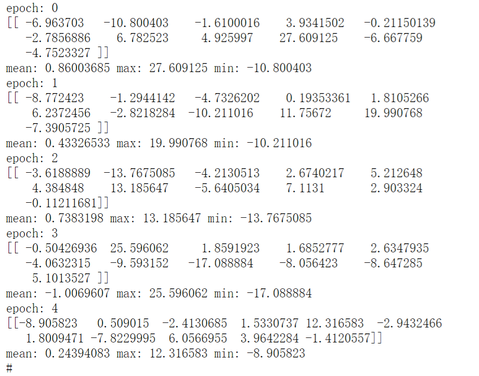

# scBERT-MindSpore

## 题目介绍

可靠的细胞类型注释是单细胞 RNA 测序数据下游分析的先决条件。现有的注释算法通常存在批次效应处理不当、缺乏精选标记基因列表或难以利用潜在基因-基因相互作用信息等问题。scBERT模型将细胞中基因的表达信息转化成可被计算机理解、学习的“语言”，并对细胞进行精准标注，实现了高解释性、高泛化性、高稳定性的单细胞类型注释技术。


## 使用的数据集

scRNA-seq(download from https://github.com/TencentAILabHealthcare/scBERT)

## 环境要求

MindSpore-GPU 2.1.0, numpy, scipy, scanpy
GPU V100

## 脚本及样例代码

 ```bash
├── code					
    └─ src
        ├── performer_mindspore.py		//模型
        ├── predict.py		            //推理脚本
        ├── preprocess.py               //数据集预处理
├── README.md   //README 
```

推理脚本运行指令

```shell
Python predict.py --model_path [模型权重路径] --data_path [数据路径]
```

## 模型参数

bin_num = 5
gene_num = 16906
novel_type = False
unassign_thres = 0.5
pos_embed = True

## 评估结果

模型仅实现推理脚本，推理结果如下图所示



## 参考资料

论文：scBERT: a Large-scale Pretrained Deep Langurage Model for Cell Type Annotation of Single-cell RNA-seq Data

模型参考: https://github.com/TencentAILabHealthcare/scBERT

内容来源：https://openi.pcl.ac.cn/izayoi/scBERT-MindSpore